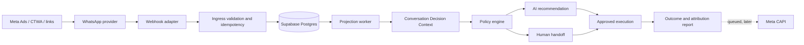

# Plano de Implementação — TX Commercial Core

**Data:** 2026-08-14  
**Status:** em execução supervisionada; P0.1, P0.2 e P0.3A concluídas localmente. As próximas fatias só avançam por gates verificáveis.
**Produto:** Sales OS para agências e PMEs: prova de tráfego, continuidade cognitiva e atendimento WhatsApp supervisionado.

## 1. Decisão de produto

O produto não será um CRM genérico nem uma cópia do CRM TX legado. O núcleo é:

`origem verificável do lead → conversa → contexto vivo → ação/handoff → resultado comercial`.

O nome técnico do kernel pode continuar **TX Commercial Core**. A experiência comercial será chamada **Sales OS**. Não serão construídos agora: ERP, hotelaria, automações genéricas, “agentes faz-tudo”, CRM de campo livre ou dashboard sem fonte de dados.

## 2. Golden Path do piloto

1. Uma conta autenticada cria/entra no workspace da cliente.
2. Um webhook WhatsApp válido e idempotente chega com mensagem e metadados disponíveis de CTWA/UTM.
3. O sistema persiste o evento bruto e a mensagem; resolve contato e jornada aberta sem duplicar dados.
4. O motor materializa o `ConversationDecisionContext`: origem, gancho, fatos conhecidos, estágio, atrito, responsável e próximo passo.
5. A IA apenas recomenda uma ação/draft dentro da política. Ações de risco (preço não aprovado, pagamento, confirmação, fallback inseguro) exigem humano.
6. O operador aceita o handoff ou envia uma resposta. A ação executada fica auditável.
7. Ao ganhar/perder, registra resultado e mantém um registro de atribuição; CAPI entra depois em fila com retry e idempotência.

**Aceite do Golden Path:** uma jornada CTWA de teste percorre os sete passos, produz um dossiê de handoff e permite demonstrar a origem e o resultado sem consultar o CRM legado.

## 3. Arquitetura alvo

### Limites de camada

| Camada | Responsabilidade | Não pode fazer |
|---|---|---|
| Interface | HTTP, assinatura, DTO Zod, resposta de erro | regra comercial ou SQL arbitrário |
| Application | ingestão, projeção, política, casos de uso | depender de WAHA/Meta diretamente |
| Domain | estados, transições, fatos/inferências, guardrails | Fastify, `pg`, variáveis de ambiente |
| Infrastructure | Postgres, Redis/BullMQ, WAHA/Cloud, OpenRouter, CAPI | decidir política comercial |

## 4. Contrato de dados — correções necessárias antes do piloto

Os 11 objetos de negócio existentes são o vocabulário. Eles não cobrem a trilha técnica mínima. Adicionar, sem diluir o domínio:

| Tabela | Papel | Invariantes P0 |
|---|---|---|
| `workspace_memberships` | vínculo de usuário e workspace | único por usuário/workspace; papéis owner/operator/viewer |
| `channel_connections` | uma conexão WhatsApp configurada | segredo fora da tabela ou cifrado; pertence a um workspace |
| `inbound_channel_events` | envelope bruto imutável | `provider + provider_event_id` único; payload com retenção e PII definida |
| `conversation_messages` | mensagem normalizada de entrada/saída | única por conexão + provider_message_id; sempre ligada a jornada e workspace |
| `projection_checkpoints` | versão/posição de projeção | reprocessável; não é fonte primária |
| `outbox_events` | publicação confiável para fila/CAPI | idempotency key, status, tentativas, erro sanitizado |

Correções nas tabelas já geradas:

- Toda tabela que participa de consulta multi-tenant precisa de `workspace_id` direto ou de política verificável via jornada; para o P0 preferir o campo direto e índices compostos por workspace.
- `DecisionEvent` precisa de `workspace_id`, tipo de evento, versão de projeção, correlação e chave de idempotência.
- `KnownFact.key` não pode conter chaves próprias de escovaria ou película. Usar namespace extensível (`profile.*`, `offer.*`, `vehicle.*`, `service.*`) validado por catálogo do workspace.
- Receita deve usar `amount_minor` inteiro e `currency`, nunca `NUMERIC` como contrato de aplicação.
- Remover a confiança `1.0` como default para inferências: ela deve ser explicitamente calculada.
- Fatos, eventos e ações executadas precisam de proteção contra `UPDATE`/`DELETE` indevidos; correções entram como novo evento ou supersessão auditável.

## 5. Segurança e tenancy

1. Inicializar repositório Git independente antes de evoluir código; commits pequenos por fatia. Não usar o Git do CRM TX legado.
2. A fonte de identidade é Supabase Auth. Nenhum endpoint de operador aceita `workspaceId` livremente do corpo da requisição.
3. RLS deve usar `auth.uid()` e `workspace_memberships`; a policy atual `service_role_all_*` é aceitável apenas para jobs internos e não é isolamento de usuário.
4. O adaptador interno usa uma role de serviço mínima. Webhooks possuem assinatura, timestamp, replay window e idempotência.
5. Validar todo input com Zod; devolver erros estáveis sem payload, token ou stack trace.
6. Segredos ficam somente em `.env` local/secret store. Remover exemplos de senhas e chaves que pareçam utilizáveis; `.env.example` contém apenas placeholders explícitos.

## 6. Infra local: decisão definitiva

**Supabase local via Docker é o único PostgreSQL do projeto.** O `docker-compose.yml` não deve subir um PostgreSQL paralelo.

- `npx supabase start` / `stop` gerencia banco, Auth, API, Studio e Realtime usando o `supabase/config.toml` nas portas isoladas 55430–55434.
- Docker Compose mantém somente Redis dedicado na 6381, com healthcheck e volume nomeado.
- `supabase/migrations` é a única fonte do esquema; seed é demonstrativo e nunca contém PII real.
- Scripts obrigatórios: `infra:up`, `infra:down`, `db:reset`, `test:unit`, `test:integration`, `test:coverage`, `check`.

## 7. APIs P0

| Método | Rota | Regra |
|---|---|---|
| `GET` | `/health` | app, db e redis; sem segredos |
| `POST` | `/v1/webhooks/whatsapp/:provider` | assinatura + dedupe + retorno rápido `202` |
| `GET` | `/v1/journeys/:id/context` | membro do workspace; retorna projeção viva |
| `GET` | `/v1/handoffs?status=PENDING` | membro operador/owner; paginação |
| `POST` | `/v1/handoffs/:id/accept` | transição condicional atômica |
| `POST` | `/v1/recommendations/:id/approve` | política e ator auditados |
| `POST` | `/v1/journeys/:id/outcome` | resultado idempotente; enfileira CAPI, não chama síncrono |
| `GET` | `/v1/reports/attribution` | owner/viewer; período, definição e fonte explícitos |

Não haverá endpoint de envio automático livre no P0. A IA só produz recomendação; o adaptador de envio entra após a política, aprovação e observabilidade estarem prontas.

## 8. Plano de execução por fatias

| Ordem | Entregável | Dependência | Gate de aceite | Rollback |
|---|---|---|---|---|
| P0.1 | Infra isolada, scripts e Supabase + Redis | concluída (`ddceec5`) | migrações, seed e testes locais executáveis | parar containers e reverter commit |
| P0.2 | Contrato v2, RLS, RBAC, invariantes e outbox | concluída (`edab01d`, `d425e97`) | isolamento de tenant e concorrência cobertos por integração | migration corretiva; nunca apagar fatos |
| P0.3A | Ingestão WAHA local: HMAC, dedupe, normalização e worker | concluída (`35251fa`) | fixture oficial, payload inválido, repetição e outbox cobertos | desativar webhook/worker local |
| P0.3B | Runtime produtivo: ports server-only, referências Vault, readiness e workers desacoplados | concluída localmente, aguardando P0.3C | produção só aceita ports explícitos; health/readiness distinguem banco, Redis e worker; segredos não passam por logs/SQL | desligar runtime e manter ingestão pausada |
| P0.3C | Homologação WAHA real em staging | P0.3B + instância WAHA de teste | webhook real, reenvio, falha de provedor e recuperação validados com evidência | remover assinatura/canal de staging e pausar worker |
| P0.4 | Handoff, política de ação e envio supervisionado | P0.3C | transições atômicas; uma ação bloqueada não gera envio; operador consegue assumir e responder | kill switch por workspace/canal |
| P0.5 | Continuidade cognitiva e recomendação IA supervisionada | P0.4 | recomendação possui fatos/evidência; timeout ou erro não bloqueia o humano; PII redigida | desligar provider e manter fila humana |
| P0.6 | Cockpit mínimo de operação e contexto vivo | P0.4/P0.5 | operador visualiza origem, conversa, próximo passo, handoff e resultado em menos de 5 minutos | servir versão anterior; dados permanecem imutáveis |
| P0.7 | Atribuição, outcomes, Meta CAPI e relatório de prova do tráfego | P0.6 | resultado idempotente, evidência/confiança explícitas e CAPI por outbox reconciliável | pausar worker CAPI |
| P0.8 | Hardening e piloto privado | P0.3B–P0.7 | backup/restore, observabilidade, UAT, runbooks e go/no-go assinados | kill switch, rollback de app e restauração testada |

## 9. Testes e observabilidade

### Guardrails comportamentais da tese

- **Origem degradada sem invenção:** quando CTWA ou tracking determinístico não estiver disponível, o contexto registra explicitamente `UNATTRIBUTED` ou uma hipótese `LOW_TIME_WINDOW`. O texto da IA não pode mencionar campanha, oferta ou gancho como fato sem evidência associada.
- **Momentum medido antes de autonomia:** `time_to_first_response`, `time_to_recommendation`, `handoff_wait_time` e `time_to_human_accept` são métricas separadas. Estouro de SLA gera escalonamento operacional; não libera envio automático por conta própria.
- **Nunca perguntar duas vezes:** uma ação de coleta é bloqueada quando já existe fato ativo, não supersedido, compatível com a intenção, dentro da validade definida pelo catálogo e com autoridade suficiente. O limite de confiança é apenas um dos critérios; fatos antigos ou conflitantes pedem confirmação curta, não repetição cega.
- **Prova com grau de evidência:** todo relatório mostra método, evidência e confiança. `HIGH_CTWA` pode sustentar atribuição determinística; `LOW_TIME_WINDOW` aparece como estimativa, nunca como prova.
- **Mensagem imutável, status como evento:** conteúdo e metadados originais de `conversation_messages` não sofrem atualização. Entrega, leitura, falha, edição/revogação do provedor entram como eventos append-only e alimentam uma projeção de status.

### Pirâmide mínima

- Unitários: máquina de estados, policy engine, normalização, atribuição e dedupe.
- Integração: migrações, RLS em dois workspaces, transações, outbox e webhook assinado.
- Contrato: payload WAHA/Cloud fixture versionado; nunca credencial/live provider.
- E2E: uma jornada CTWA simulada até handoff e outcome.

### Métricas operacionais

- latência de webhook e taxa de dedupe;
- mensagens sem jornada/contexto;
- idade do contexto e falhas de projeção;
- recomendações por status de política e aprovação humana;
- tempo até primeira resposta/handoff;
- atribuições por nível de confiança e receita atribuída;
- outbox/CAPI: backlog, retry, falhas definitivas.

Logs serão estruturados com `workspace_id`, `journey_id`, `correlation_id` e `event_id`; texto de mensagem, telefone, tokens e segredos não entram em logs.

## 10. Riscos conhecidos e decisões

| Risco | Decisão |
|---|---|
| Dois agentes editam a mesma pasta | reservar arquivos/fatias; rodar `git status` antes/depois; commits pequenos |
| Supabase e Postgres paralelo divergem | eliminar Postgres bruto do Compose na P0.1 |
| RLS decorativo com `service_role` | teste negativo por usuário/workspace é requisito de merge |
| IA responder com contexto errado | modo recomendação primeiro; política determinística e kill switch |
| Atribuição apresentada como certeza | exibir confiança e evidência; `LOW_TIME_WINDOW` não vira prova |
| Webhook duplicado/fora de ordem | persistir evento, idempotency key, ordenação e projeção reprocessável |
| Aprovação humana demora e mata o momentum | SLA separado de geração e aceite, fila priorizada e escalonamento; autonomia somente após evidência |
| Confiança alta em fato vencido bloqueia pergunta necessária | política considera fonte, validade, supersessão, conflito e intenção, não apenas um threshold |

## 11. Definição de pronto para piloto privado

- [ ] Repositório independente e documentação aponta para a raiz nova.
- [ ] Supabase Docker e Redis isolados sobem em uma instrução documentada.
- [ ] Migrações e seed resetam do zero; sem PII real.
- [ ] Dois workspaces não conseguem ler/gravar os dados um do outro.
- [ ] Webhook duplicado é inofensivo e observável.
- [ ] Uma conversa possui origem, contexto e handoff verificáveis.
- [ ] IA não envia mensagem nem confirma pagamento/agendamento sem política e aprovação aplicáveis.
- [ ] Testes unitários, integração e Golden Path passam localmente.
- [ ] Logs/health mostram falhas sem expor PII/segredos.
- [ ] Há kill switch por workspace e runbook de rollback.

## 12. Decisões assumidas neste plano

1. O primeiro piloto é Haven Escovaria, mas o modelo de dados não codifica o nicho.
2. WAHA é um adaptador inicial; o domínio não depende dele e Meta Cloud pode substituí-lo.
3. Supabase Auth + RLS é a fronteira de acesso; a API Fastify mantém regras adicionais de papel.
4. IA começa como copiloto supervisionado, não como atendente autônomo.
5. A primeira entrega visível é o Golden Path e não um dashboard completo.

## GSTACK REVIEW REPORT

**Escopo detectado:** produto novo, UI futura, API e DX internos.  
**Decisão de escopo:** construir primeiro o núcleo verificável, depois cockpit/relatório, depois automação.  
**Estado do pipeline:** premissas confirmadas em 2026-08-14; revisão do plano parte do commit `35251fa`.
**Próxima fatia proposta:** P0.3C — homologação WAHA real em staging, sem envio comercial autônomo.

### Phase 1 — Premise Challenge

| Premissa | Avaliação | Evidência atual | Risco se estiver errada |
|---|---|---|---|
| O problema central é perda de contexto e incapacidade de atender a demanda do WhatsApp | Forte, ainda precisa ser medida no piloto | relato direto das clientes e histórico de falhas do CRM TX | construir automação para um gargalo diferente do real |
| A origem do lead precisa permanecer ligada à conversa e ao resultado | Forte | objetivo de prestação de contas da agência e CTWA como canal de entrada | relatório vira correlação apresentada como prova |
| O novo sistema deve substituir o CRM TX para este caso, sem reutilizar seu runtime | Forte | acoplamento e incidentes observados no legado; novo repositório isolado | duplicar complexidade ou importar dívida antiga |
| IA de atendimento é essencial desde o produto inicial | Parcial | necessidade comercial é real, mas autonomia não precisa nascer no primeiro release | enviar informação errada ou perder venda sem trilha humana |
| O primeiro passo de IA deve ser recomendação supervisionada | Forte | reduz dano e permite medir aprovação antes de automatizar | produto pode parecer menos “mágico”, mas permanece operável |
| Haven é o primeiro piloto e o domínio deve continuar neutro ao nicho | Forte | Haven oferece cenário real; o segundo caso já é película automotiva | codificar perguntas e fatos exclusivos da escovaria |
| Supabase local via Docker deve ser a fonte única de dados | Forte e explicitamente decidido | configuração local já existe; Compose atual ainda conflita | dois bancos locais divergentes e testes enganosos |

### Gate de premissas

Antes das revisões de design, engenharia e DX, confirmar:

1. O produto inicial entrega **copiloto supervisionado**, com automação completa somente após métricas e políticas.
2. O primeiro Golden Path é **anúncio/CTWA → conversa → contexto → handoff/ação → resultado**, não um CRM genérico.
3. O piloto primário é Haven, mas o núcleo deve servir também à empresa de películas sem mudanças estruturais.
4. Supabase Docker é o único PostgreSQL do projeto; Redis permanece isolado para filas.

**Resultado:** confirmado pelo owner em 2026-08-14. Estas premissas são contrato de produto para todas as fatias abaixo; qualquer mudança exige novo gate explícito.

### Estado verificado no início da revisão

| Fatia | Evidência no repositório | Limite atual |
|---|---|---|
| P0.1 | `ddceec5` | infraestrutura e contrato local não equivalem a produção |
| P0.2 | `edab01d`, `d425e97` | RLS e outbox exigem prova em runtime server-only |
| P0.3A | `35251fa` | ingestão WAHA está coberta por fixtures, ainda sem homologação com provedor real |
| P0.3B | branch ativa `gemini/p0-3b-production-runtime` | implementada localmente: ports explícitos, resolver por referência, readiness fail-closed e worker desacoplado |

### Ordem de revisão e execução

1. Homologar P0.3C com uma conta WAHA de staging antes de permitir qualquer saída comercial.
2. Construir P0.4 e P0.5 com humano no circuito: handoff, política e recomendação antes de autonomia.
3. Entregar P0.6 e P0.7 como ferramenta operacional enxuta: contexto, próximo passo, outcome e prova de tráfego.
6. Liberar piloto apenas após P0.8: observabilidade, restore testado, UAT e runbooks.

### Decision Audit Trail

| # | Fase | Decisão | Classificação | Princípio | Racional | Alternativa rejeitada |
|---|---|---|---|---|---|---|
| 1 | CEO | Núcleo focado em continuidade e prova de tráfego | Mecânica | DRY / explícito | evita recriar módulos genéricos já responsáveis pela dívida do legado | CRM horizontal completo |
| 2 | CEO | IA começa supervisionada | Gate humano | segurança / reversibilidade | valida contexto e política com vendas reais antes de enviar autonomamente | autonomia total no primeiro release |
| 3 | CEO | Arquitetura neutra ao nicho | Mecânica | completude | suporta Haven e películas com catálogo configurável | chaves de domínio fixas por nicho |
| 4 | Eng | Uma fonte PostgreSQL local | Mecânica | simplicidade explícita | remove divergência entre Compose e Supabase CLI | Postgres bruto paralelo |
| 5 | Produto | SLA humano não libera automação automaticamente | Mecânica | segurança / evidência | urgência operacional deve escalar pessoas antes de ampliar autoridade da IA | autoaprovação por timeout |
| 6 | Domain | Repetição de pergunta usa validade semântica do fato | Mecânica | explícito / completude | confiança isolada não detecta fato vencido, contradito ou de outro contexto | regra fixa `confidence >= 0.8` |
