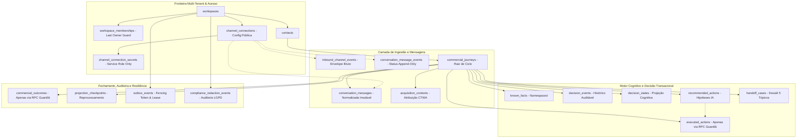

# Revisão de Engenharia P0.1/P0.2 — Sales OS (TX Commercial Core)

> **Documento:** `docs/P0_1_P0_2_ENGINEERING_REVIEW.md`  
> **Data:** 14 de Agosto de 2026  
> **Baseline:** `edab01d` + hardening de segurança e concorrência da branch `codex/p0-2-hardening`  
> **Status:** Validação local automatizada; homologação externa ainda pendente  

---

## 1. Veredito

| Fase | Status | Justificativa Baseada no Código |
|---|---|---|
| **P0.1 (Infraestrutura & DX)** | **VALIDADO LOCALMENTE** | Supabase dedicado e Redis isolado, migração recriada do zero, TypeScript e build validados. Realtime precisa estar saudável antes do fluxo que depender dele. |
| **P0.2 (Contrato de Dados & Tenancy)** | **VALIDADO LOCALMENTE** | 20 tabelas com RLS, allowlist explícita de RPCs, last-owner sob concorrência, idempotência com fingerprint e outbox com fencing obrigatório por RPC. Homologação externa continua sendo um gate separado. |


---

## 2. Arquitetura Alvo & Fronteiras de Segurança

### 2.1 Diagrama de Dependências de Domínio e Dados



---

## 3. Os 6 Ajustes Finais de Engenharia

### 3.1 Isolamento Físico de Segredos de Conexão (`channel_connection_secrets`)
* **Problema:** Como o RLS atua em nível de linha (*Row Level Security*), conceder `SELECT` em `channel_connections` para `operator` e `viewer` expõe todo o conteúdo do `config JSONB`, incluindo credenciais de API.
* **Solução de Arquitetura:**
  1. `channel_connections`: Armazena apenas metadados públicos e não sensíveis (`id`, `workspace_id`, `provider`, `phone_number`, `name`, `status`, `public_config`).
  2. `channel_connection_secrets`: Tabela segregada contendo apenas referências UUID ao Vault para API key e webhook secret.
  3. **Política de Acesso:** RLS em `channel_connection_secrets` com **acesso exclusivo ao `service_role`** (e RPC autenticada para inserção/rotação restrita a `owner`).

### 3.2 Ações Comerciais e Fechamentos via RPC Transacional Guardiã
* **Problema:** Acesso direto via `INSERT` em `executed_actions` e `commercial_outcomes` por operadores permitiria criar ações fora de sequência, sem validar políticas de segurança e sem gerar os eventos de outbox correspondentes.
* **Solução:**
  * Revogar permissão de `INSERT` direto em `executed_actions` e `commercial_outcomes` para o papel `authenticated`.
  * Criação das RPCs transacionais com `SECURITY DEFINER` e `SET search_path = ''`:
    * `public.execute_commercial_action(p_workspace_id, p_journey_id, p_recommended_action_id, p_action, p_message_id)`: Valida se a jornada está aberta, se o usuário é `operator`/`owner`, grava a ação e insere o evento de outbox na mesma transação.
    * `public.record_commercial_outcome(p_workspace_id, p_journey_id, p_result, p_revenue_minor, p_reason)`: Valida o estado da jornada, encerra o ciclo, grava o desfecho e enfileira o disparo de CAPI no outbox.

### 3.3 Proteção do Último Owner (*Last Owner Guard*)
* **Problema:** Um owner poderia acidentalmente se deletar ou se rebaixar para `operator`, tornando o workspace órfão.
* **Solução:**
  * Trigger `BEFORE UPDATE OR DELETE ON public.workspace_memberships` que garante invariância:
    ```sql
    IF (OLD.role = 'owner' AND (TG_OP = 'DELETE' OR NEW.role != 'owner')) THEN
      IF (SELECT COUNT(*) FROM public.workspace_memberships WHERE workspace_id = OLD.workspace_id AND role = 'owner' AND id != OLD.id) = 0 THEN
        RAISE EXCEPTION 'Operation blocked: Cannot remove or demote the last owner of workspace %', OLD.workspace_id;
      END IF;
    END IF;
    ```

### 3.4 LGPD: Pseudonimização Aleatória e Redação Auditável
* **Problema:** Hash de telefone simples sem salt tem baixa entropia (pode ser revertido por rainbow tables) e declarações genéricas de retenção de 5 anos não substituem governança técnica.
* **Solução:**
  1. Criação da tabela de auditoria `compliance_redaction_events` (`id`, `workspace_id`, `contact_id`, `reason`, `requested_by_user_id`, `executed_at`).
  2. Procedimento privilegiado `anonymize_contact_pii`:
     - Substituição do telefone por token aleatório de 128 bits sem vínculo reversível.
     - Limpeza de nomes e e-mails (`NULL`).
     - Redação de mensagens (`[CONTEUDO_ANONIMIZADO_LGPD]`).
     - Preservação da integridade estrutural das jornadas e desfechos para reconciliação contábil e fiscal.

### 3.5 Outbox Worker com Fencing Tokens e Lease Consistente
* **Problema:** Se a lease de um worker 1 expira e o worker 2 assume o evento, o worker 1 atrasado poderia tentar marcar `PUBLISHED` e sobrescrever o estado.
* **Solução:**
  1. Adição de `claim_token UUID` (Fencing Token) e `scheduled_for TIMESTAMPTZ` como campo canônico unificado.
  2. Índice de lease: `CREATE INDEX idx_outbox_processing_lease ON outbox_events(status, locked_at) WHERE status = 'PROCESSING';`
  3. Conclusão, renovação de lease e falha são feitas somente pelas RPCs guardiãs, validando token e worker:
     ```sql
     SELECT public.complete_outbox_event($event_id, $claim_token, $worker_id);
     SELECT public.renew_outbox_lease($event_id, $claim_token, $worker_id);
     SELECT public.fail_outbox_event($event_id, $claim_token, $worker_id, $error, $retry_delay_seconds);
     ```

### 3.6 Estratégia de Migração Greenfield
* **Decisão:** Consolidar todas as melhorias na migração canônica `20260814000001_initial_domain_schema.sql`, executar `npm run db:reset`, e congelar o baseline para que a partir da P0.3 as migrações sigam estritamente o modelo *forward-only* (`00002_...`).

---

## 4. Matriz RBAC Definitiva

| Recurso / Tabela | Operação | Owner | Operator | Viewer | Service Worker (`service_role`) |
|---|---|---|---|---|---|
| **`workspaces`** | `SELECT` / `UPDATE` | ✅ Total | 👁️ Apenas SELECT | 👁️ Apenas SELECT | ✅ Total |
| **`workspace_memberships`** | `SELECT` / `INSERT` / `UPDATE` / `DELETE` | ✅ Com Last Owner Guard | 👁️ Apenas SELECT | 👁️ Apenas SELECT | ✅ Total |
| **`channel_connections`** | `SELECT` / `INSERT` / `UPDATE` / `DELETE` | ✅ Total (sem segredos) | 👁️ Apenas SELECT | 👁️ Apenas SELECT | ✅ Total |
| **`channel_connection_secrets`** | `SELECT` / `INSERT` / `UPDATE` | ❌ Sem Leitura Direta | ❌ Sem Acesso | ❌ Sem Acesso | ✅ Total |
| **`contacts`** | `SELECT` / `INSERT` / `UPDATE` | ✅ Total | ✅ Total | 👁️ Apenas SELECT | ✅ Total |
| **`commercial_journeys`** | `SELECT` / `INSERT` / `UPDATE` | ✅ Total | ✅ Total | 👁️ Apenas SELECT | ✅ Total |
| **`inbound_channel_events`** | `SELECT` | 👁️ Apenas SELECT | 👁️ Apenas SELECT | ❌ Sem Acesso | ✅ Total |
| **`conversation_messages`** | `SELECT` | 👁️ Apenas SELECT | 👁️ Apenas SELECT | 👁️ Apenas SELECT | ✅ Total |
| **`conversation_message_events`** | `SELECT` | 👁️ Apenas SELECT | 👁️ Apenas SELECT | 👁️ Apenas SELECT | ✅ Total |
| **`acquisition_contexts`** | `SELECT` | 👁️ Apenas SELECT | 👁️ Apenas SELECT | 👁️ Apenas SELECT | ✅ Total |
| **`known_facts`** | `SELECT` / `INSERT` / `UPDATE` | ✅ Total | ✅ Total | 👁️ Apenas SELECT | ✅ Total |
| **`decision_events`** | `SELECT` / `INSERT` | 👁️ Apenas SELECT | ✅ `INSERT` | 👁️ Apenas SELECT | ✅ Total |
| **`decision_states`** | `SELECT` | 👁️ Apenas SELECT | 👁️ Apenas SELECT | 👁️ Apenas SELECT | ✅ Total |
| **`recommended_actions`** | `SELECT` | 👁️ Apenas SELECT | 👁️ Apenas SELECT | 👁️ Apenas SELECT | ✅ Total |
| **`executed_actions`** | `SELECT` | 👁️ Apenas SELECT | 👁️ Apenas SELECT *(via RPC)* | 👁️ Apenas SELECT | ✅ Total |
| **`handoff_cases`** | `SELECT` / `UPDATE` | ✅ Total | ✅ Total | 👁️ Apenas SELECT | ✅ Total |
| **`commercial_outcomes`** | `SELECT` | 👁️ Apenas SELECT | 👁️ Apenas SELECT *(via RPC)* | 👁️ Apenas SELECT | ✅ Total |
| **`compliance_redaction_events`**| `SELECT` | 👁️ Apenas SELECT | ❌ Sem Acesso | ❌ Sem Acesso | ✅ Total |
| **`projection_checkpoints`** | `SELECT` | ❌ Sem Acesso | ❌ Sem Acesso | ❌ Sem Acesso | ✅ Total |
| **`outbox_events`** | `SELECT` | ❌ Sem Acesso | ❌ Sem Acesso | ❌ Sem Acesso | ✅ Total |

---

## 5. Plano de Execução do Hardening Final

| Ordem | Tarefa | Arquivos Impactados | Validação |
|---|---|---|---|
| **HF-1** | Atualizar schema SQL com `channel_connection_secrets`, `compliance_redaction_events`, Last Owner Trigger, RPCs guardiãs e Fencing Token no Outbox | `supabase/migrations/20260814000001_initial_domain_schema.sql` | `npm run db:reset` executa com sucesso. |
| **HF-2** | Sincronizar seed com segregação de segredos de canal | `supabase/seed.sql` | Seed aplica sem violação de FKs ou RLS. |
| **HF-3** | Atualizar tipos TypeScript de domínio | `src/domain/types/index.ts` | `npx tsc --noEmit` retorna 0 erros. |
| **HF-4** | Expandir testes de integração (Last Owner Guard, RPCs de Ação/Fechamento, Fencing Token, Isolamento de Segredos) | `tests/integration/rbac-and-security.test.ts`, `database-schema.test.ts` | Todos os testes passam 100% verdes. |
| **HF-5** | Atualizar `CODEBASE.md` e emitir parecer final | `CODEBASE.md` | Documentação técnica congelada e sincronizada. |

---

## 6. Go/No-Go para P0.3 (Ingestão WhatsApp)

- [x] **Critério 1 (Integridade Referencial):** Foreign Keys compostas `(workspace_id, parent_id)` em 100% das relações dependentes.
- [x] **Critério 2 (Segurança de Segredos):** Segregação física de `channel_connection_secrets` inacessível a operadores e viewers.
- [x] **Critério 3 (Governança Transacional):** Inserção de `executed_actions` e `commercial_outcomes` blindada por RPCs guardiãs.
- [x] **Critério 4 (Resiliência do Outbox):** Fencing tokens (`claim_token`) e controle atômico contra stale workers.
- [x] **Critério 5 (Governança de Tenancy):** Last Owner Guard ativo impedindo orfandade de workspace.
- [x] **Critério 6 (LGPD & Auditoria):** Procedimento auditável com token aleatório e autor derivado da sessão.
- [x] **Critério 7 (Suíte de Testes):** Testes de integração cobrindo a matriz RLS e cenários negativos.

```text
STATUS DO GATE P0.3: APTO PARA IMPLEMENTAÇÃO LOCAL APÓS SUÍTE FINAL VERDE;
PRODUÇÃO CONTINUA SUJEITA A HOMOLOGAÇÃO EXTERNA E GOLDEN PATH.
```
