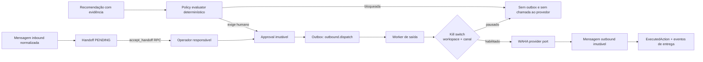

# P0.4 — Handoff Humano e Execução Supervisionada

**Status:** planejada após a homologação local P0.3C. Não autoriza IA autônoma,
envio comercial automático, Meta CAPI ou acesso de cliente.

## Resultado que esta fatia precisa entregar

Um operador autenticado consegue assumir uma conversa, ver o dossiê, aprovar
uma recomendação e enviar uma resposta por um canal explicitamente habilitado.
O sistema precisa provar quem aprovou, qual política foi aplicada e impedir o
envio quando o workspace ou canal estiver pausado.



## Princípios não negociáveis

1. **Humano primeiro:** nenhuma recomendação provoca envio por si só. A aprovação
   é um fato imutável de ator autenticado.
2. **Falha segura:** `outbound_enabled` começa desligado. Canal desconhecido,
   política desconhecida ou controle indisponível significam bloqueio.
3. **Revalidação no último momento:** o worker verifica a política e o kill switch
   após reclamar o outbox e imediatamente antes de chamar WAHA.
4. **Sem telefone inventado:** um `@lid` sem mapeamento verificável continua fora
   de uma ação outbound.
5. **Envio idempotente:** toda tentativa usa a chave da ação/dispatch. Se o
   provedor não aceitar idempotência por message ID, não se habilita dispatch
   automático para esse adaptador.

## Esquema e invariantes

### 1. Vínculo de canal e controles

Adicionar migration forward-only:

| Objeto | Campos essenciais | Invariantes |
|---|---|---|
| `commercial_journeys.channel_connection_id` | UUID opcional para legados, obrigatório em novas jornadas de canal | FK composta `(workspace_id, channel_connection_id)`; não permite executar fora do canal de origem |
| `workspace_operation_controls` | `workspace_id PK`, `outbound_enabled`, `reason`, `changed_by_user_id`, `changed_at` | default `false`; somente owner altera |
| `channel_operation_controls` | `(workspace_id, channel_connection_id) PK`, `outbound_enabled`, motivo, ator, data | override por canal; somente owner altera |
| `operation_control_events` | controle, valor anterior/novo, motivo, ator, data | append-only; trilha de kill switch |

O valor efetivo é `workspace.outbound_enabled AND channel.outbound_enabled`.
Ausência de controle de canal equivale a `false`.

### 2. Handoff e aprovação auditáveis

| Objeto | Papel | Invariantes |
|---|---|---|
| `handoff_case_events` | transições append-only | `PENDING → ACCEPTED → RESOLVED` ou `ACCEPTED → RETURNED_TO_AI`; não há update livre de estado |
| `action_approvals` | aprovação humana imutável | único por recommendation/version; operador pertence ao workspace; registra versão de política e evidências |
| `outbound_dispatches` | estado técnico de envio | único por `executed_action_id`; claim lease, provider idempotency key, tentativa, erro sanitizado |

Substituir o `UPDATE` direto de `handoff_cases` por RPCs condicionais:

- `accept_handoff(workspace_id, handoff_id, idempotency_key)`;
- `resolve_handoff(workspace_id, handoff_id, idempotency_key)`;
- `return_handoff_to_ai(workspace_id, handoff_id, reason, idempotency_key)`;
- `approve_recommended_action(workspace_id, recommendation_id, evidence_snapshot, policy_version, idempotency_key)`.

Cada RPC valida RBAC, workspace, transição atual e idempotência. Duas tentativas
simultâneas de aceite retornam o mesmo resultado para a vencedora ou conflito
sem sobrescrever responsável.

### 3. Política determinística antes de IA

Criar `PolicyEvaluator` puro, versionado e testável. Entrada mínima:

```ts
type PolicyInput = {
  action: CommercialActionType;
  journeyId: string;
  channelConnectionId: string;
  actor: 'operator' | 'system' | 'ai';
  hasHumanApproval: boolean;
  outboundEnabled: boolean;
  templateApproved: boolean;
  consentPresent: boolean;
};
```

Saída: `ALLOWED`, `REQUIRES_HUMAN_APPROVAL` ou `BLOCKED_BY_POLICY`, sempre com
`policyVersion`, razões legíveis e códigos estáveis. No P0.4:

- `SEND_PAYMENT`, `CONFIRM_BOOKING` e qualquer ação `ai/system` permanecem
  `BLOCKED_BY_POLICY`;
- resposta de operador exige canal habilitado e aprovação explícita quando
  derivada de recomendação;
- política desconhecida ou sem evidência retorna bloqueio, não fallback.

## Ports, workers e fluxo de saída

Criar um `OutboundMessageProvider` sem dependência de WAHA:

```ts
sendHumanApprovedReply({
  channelConnectionId, providerSession, recipient, text,
  idempotencyKey, correlationId,
}): Promise<{ providerMessageId: string; sentAt: Date }>;
```

O adaptador WAHA entra em infraestrutura. A API e o domínio dependem apenas do
port. O worker `OutboundDispatchWorker` consome somente `outbound.dispatch` e:

1. reclama um dispatch com lease;
2. relê aprovação, política e controles de operação;
3. se bloqueado, grava falha de política e conclui sem chamada externa;
4. envia com chave idempotente suportada pelo provider;
5. insere `conversation_messages` de saída e `conversation_message_events`;
6. grava `ExecutedAction` somente para a ação aprovada e conclui outbox.

O provider nunca recebe telefone, corpo ou token em logs estruturados.

## API interna autenticada

Todas exigem sessão Supabase Auth e RBAC, recebem `Idempotency-Key` onde mudam
estado e devolvem erros estáveis sem payload interno.

| Rota | Regra |
|---|---|
| `GET /v1/handoffs?status=PENDING` | owner/operator; paginação; somente workspace do token |
| `POST /v1/handoffs/:id/accept` | chama RPC condicional; operador vira responsável |
| `POST /v1/handoffs/:id/resolve` | somente responsável ou owner |
| `POST /v1/recommendations/:id/approve` | snapshot de evidência/policy; não envia |
| `POST /v1/journeys/:id/replies` | somente operador; cria dispatch supervisionado, nunca envia síncrono |
| `POST /v1/controls/outbound` | somente owner; alterna workspace/canal e cria evento auditável |

Não criar endpoint público de envio, nem aceitar `workspaceId` livre no corpo.

## Matriz de aceite

| ID | Cenário | Prova |
|---|---|---|
| HND-01 | dois operadores aceitam o mesmo handoff | apenas um se torna responsável; nenhum estado perdido |
| HND-02 | viewer aceita handoff | `403`; nada muda |
| POL-01 | ação bloqueada | não cria dispatch/outbox nem chama provider |
| POL-02 | recomendação exige humano | sem `action_approval`, worker bloqueia envio |
| OUT-01 | resposta humana aprovada | uma chamada provider, uma mensagem outbound, uma ação imutável |
| OUT-02 | retry/crash após claim | mesma chave idempotente; zero duplicação visível |
| KILL-01 | workspace pausado antes do envio | provider não é chamado |
| KILL-02 | canal pausado após enfileirar | worker revalida e não envia |
| ISO-01 | ator tenta ação em outro workspace | `403/404` sem leitura/escrita cross-tenant |
| OBS-01 | falha de provider | retry/DLQ com erro sanitizado; handoff humano permanece acessível |

## Fora do escopo deliberado

- IA redigindo ou enviando mensagens automaticamente;
- pagamento, confirmação de agenda, catálogo, CAPI e campanhas;
- cockpit visual do operador, que pertence à P0.6;
- credenciais reais, VPS, DNS, TLS ou deploy.

## Gate para iniciar P0.5

P0.4 só conclui quando todos os testes HND/POL/OUT/KILL/ISO/OBS passam e uma
conta WAHA de teste demonstra: operador aceita, responde, pausa o canal, e o
sistema bloqueia a próxima saída sem perder o dossiê.
