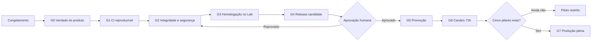

# Plano de Fechamento de Produção — SOS Sales

**Data-base:** 16 de setembro de 2026
**Status do documento:** plano proposto, pronto para execução
**Status atual da plataforma:** tecnicamente no ar, porém **NO-GO para expansão comercial**
**Release ativa verificada:** `68664732645c8b1a11a2467a48ba4f9382f0908f`
**Branch local:** `codex/production-ca-fix`
**Objetivo:** converter a instalação atual em um piloto controlado, rastreável e reversível; depois liberar produção plena somente quando os cinco pilares forem comprovados com integrações reais.

> Este documento não autoriza promoção no VPS, envio para clientes, consumo de provedores externos ou ativação ampla da IA. A promoção continua condicionada à aprovação explícita de Francisco após Docker Lab, evidências e release candidate fechado.

## 0. Decisão executiva

Congelar novas funcionalidades e executar um **Sprint de Fechamento de Produção**. A ordem é obrigatória:

1. retirar qualquer aparência de dado real onde hoje existe simulação;
2. restaurar um CI reproduzível e impedir deploy de SHA vermelho;
3. corrigir integridade transacional, segurança e supply chain;
4. homologar o fluxo real no Docker Lab com dois tenants e papéis diferentes;
5. formar um release candidate imutável;
6. promover somente após aprovação humana;
7. operar um canário supervisionado por 72 horas;
8. liberar escala apenas após os cinco pilares reais.



## 1. Leitura do cenário

### [KNOWN] Evidências atuais

| Área | Evidência atual | Consequência |
|---|---|---|
| Produção | `/health` e `/ready` respondem 200; banco, Redis e workers aparecem `ok` | Infraestrutura básica está viva, mas isso não prova o fluxo do cliente |
| CI | Os últimos runs falharam; o SHA implantado também tem run vermelho | A release atual não é reproduzível por pipeline limpo |
| Build da API | Dois erros TypeScript em `agent-routes.ts` | O backend não passa compilação limpa no ambiente de CI |
| Dependências | `bun install --frozen-lockfile` quer alterar o lockfile | Código, manifesto e lockfile divergiram |
| Agenda | A UI publicada contém horários, equipe e sincronização simulados e pode inserir disponibilidade fabricada no rascunho | Violação P0 de verdade do produto e risco comercial |
| Pipeline | Mudança de etapa e auditoria não são atômicas; erro de progressão é engolido | Corrida pode regredir etapa ou deixar alteração sem trilha confiável |
| CORS | A API reflete origem arbitrária | Superfície desnecessária para abuso por navegador |
| Supply chain | Imagens Docker usam tags flutuantes; WAHA usa `latest`; CI e produção usam majors diferentes de Node | Uma reconstrução pode produzir artefatos diferentes |
| Edge | O `Caddyfile` ativo não corresponde ao versionado e não é enviado pelo fluxo de release | Configuração crítica está fora da rastreabilidade do Git |
| Auditoria npm | Há vulnerabilidades moderadas transitivas por `express`, aparentemente não usado | Dependência dispensável amplia superfície |
| Contratos | 98/98 chamadas frontend mapeadas | Bom sinal de cobertura de rotas, sem provar regras de negócio ou integrações reais |
| Docker Lab | Daemon indisponível no diagnóstico | Não existe homologação integrada atual desta revisão |

### [INFERRED] Diagnóstico

A plataforma está **live**, mas não está comprovadamente pronta para escala. O gargalo central não é falta de feature; é falta de uma cadeia confiável entre código, CI, release, operação e evidência E2E. A agenda simulada transforma esse problema técnico em risco direto para o cliente.

### [UNVERIFIED] Itens que só podem ser declarados após homologação

- isolamento real entre dois tenants em todos os fluxos críticos;
- envio único e persistente de WhatsApp sob falha e reinício;
- CAPI recebida no Meta Test Events com o mesmo `event_id`;
- handoff humano sem resposta tardia da IA;
- agenda consultada em provedor real;
- arsenal WABA entregue e confirmado por callback;
- rollback dentro do tempo operacional definido.

## 2. Escopo e limites

### Dentro deste fechamento

- correções P0/P1 de verdade do produto, build, CI, concorrência e idempotência;
- endurecimento de CORS, headers, dependências, imagens e configuração de edge;
- testes significativos de concorrência, isolamento, filas e integrações;
- observabilidade mínima para operar WhatsApp, IA, CAPI e workers;
- Docker Lab, release candidate, promoção governada, canário e rollback;
- documentação de evidências e decisão de GO/NO-GO.

### Fora deste fechamento

- novas telas ou grandes mudanças visuais;
- novos agentes de IA;
- novos canais de aquisição;
- automações em massa;
- refatorações amplas sem relação com um risco de produção;
- agenda “aparentemente integrada” sem contrato real com o provedor.

## 3. Dois níveis de liberação

### GO para piloto controlado

Permitido somente quando G0 a G5 estiverem aprovados. A agenda pode ficar indisponível ou apenas como link externo honesto. O piloto fica restrito a um workspace, contatos allowlisted e acompanhamento humano.

### GO para produção plena

Exige G0 a G7, incluindo agenda real e os cinco pilares validados de ponta a ponta. Enquanto o pilar Agenda não tiver adaptador, persistência e resposta real do provedor, o produto não deve ser apresentado como “MVP canônico 5/5”.

## 4. Gates obrigatórios

### G0 — Verdade do produto e contenção

**Trabalho**

- `P0-01` desativar no modo de produção a agenda sintética, equipe fixa, horários gerados, falsa sincronização e inserção de slot fabricado;
- mostrar estado honesto: “Agenda externa ainda não conectada” e, se houver URL configurada pelo tenant, oferecer apenas o link externo;
- tornar o recurso `fail-closed`: sem conexão válida do backend, nenhum horário aparece;
- congelar features até a conclusão do canário.

**Critérios de saída**

- zero horários, preços, profissionais ou confirmações gerados no navegador;
- nenhum texto de disponibilidade entra no composer sem resposta autenticada do backend;
- busca no bundle de produção não encontra a configuração sintética atual;
- revisão de produto confirma que o estado vazio não promete integração inexistente.

### G1 — Build e CI reproduzíveis

**Trabalho**

- `P0-02` corrigir os dois erros TypeScript de `agent-routes.ts` e tipar a decisão do Receptionist sem coerção ampla;
- `P0-03` reconciliar `package.json`, `package-lock.json`/`bun.lock` e instalações limpas;
- escolher uma major única de Node para CI, Lab e produção; alvo recomendado: Node 22 após validação no Lab;
- transformar typecheck frontend/API, testes, build e instalação frozen em gates obrigatórios;
- corrigir a condição do AI Security Gate; manter verificações determinísticas sempre obrigatórias e usar avaliação por IA apenas como camada complementar;
- bloquear stage/promotion quando o SHA exato não tiver run verde.

**Critérios de saída**

- instalação limpa e frozen passa sem modificar lockfiles;
- frontend e API passam typecheck, testes e build a partir de diretório limpo;
- workflow completo verde no mesmo SHA do candidato;
- preflight rejeita SHA sem CI verde ou com árvore suja;
- artefatos registram SHA, checksums e versões de runtime.

### G2 — Integridade e segurança

**Trabalho de integridade**

- `P1-01` mover progressão de pipeline e gravação do evento para uma transação única no banco;
- usar atualização monotônica condicional para impedir regressão sob concorrência;
- derivar chave de idempotência de evento estável, sem `Date.now()`;
- parar de transformar falha de progressão em sucesso silencioso; classificar erro recuperável, retry e falha definitiva;
- criar reconciliador para mensagens presas em `SENDING`, com métricas e trilha de decisão;
- testar duas conexões concorrentes, retry, reinício de worker e duplicidade de callback.

**Trabalho de segurança**

- `P1-02` restringir CORS às origens oficiais e aos hosts locais apenas fora de produção;
- aplicar CSP e headers de frontend no Caddy; preservar os headers da API pelo Helmet;
- remover `express` se a confirmação de não uso permanecer válida e zerar a cadeia vulnerável associada;
- fixar imagens Docker por versão e digest, incluindo WAHA; registrar política de atualização;
- versionar, enviar e validar o `Caddyfile` no mesmo release;
- adicionar varredura de secrets, dependências e imagens ao CI;
- revisar logs para impedir token, payload sensível ou dado pessoal em texto aberto;
- executar matriz de autorização para owner, operador e viewer em dois tenants.

**Critérios de saída**

- nenhum P0/P1 aberto;
- teste concorrente prova que etapa não regride e existe exatamente um evento auditável;
- nenhuma mensagem fica indefinidamente em `SENDING`;
- origem não permitida não recebe CORS;
- zero vulnerabilidade alta/crítica; qualquer risco residual tem aceite registrado;
- reconstrução usa os mesmos runtimes e digests;
- tenant B não lê, altera ou aciona recursos do tenant A.

### G3 — Homologação integrada no Docker Lab

O Lab deve ser reconstruído a partir do SHA candidato. Dados de teste precisam ser identificados e isolados; não entram no artefato de produção.

| Pilar | Cenário mínimo | Evidência obrigatória |
|---|---|---|
| 1. WhatsApp + Cockpit + Funil | receber, responder, recarregar, concluir, reabrir e mover etapa; testar mais de 50 conversas | IDs de jornada/mensagem, estado antes/depois e ausência de duplicidade |
| 2. Meta Ads + CAPI | gerar evento real de teste, persistir outbox, enviar e confirmar no Meta Test Events | `event_id` idêntico, resposta do provedor, retry e estado final |
| 3. Agente 24/7 + Handoff | contato controlado, uma resposta, assumir humano, silenciar IA, devolver à IA e encerrar | correlation IDs e prova de zero resposta após handoff/fechamento |
| 4. Agenda | consultar disponibilidade real, reservar/espelhar e lidar com indisponibilidade | resposta do provedor e persistência; se ausente, pilar fica `BLOCKED`, UI permanece indisponível |
| 5. Dual Engine WAHA + WABA | validar ao menos texto, mídia e um recurso interativo em cada engine aplicável | IDs do provedor, callbacks e estado persistido |

**Testes transversais**

- dois tenants e três papéis;
- perda e retorno de Redis, banco e provider;
- retry sem envio duplicado;
- reload da UI sem perda de estado confirmado;
- indisponibilidade de IA com fallback humano;
- segredo inválido/expirado com falha fechada;
- logs correlacionados da entrada até o callback.

**Critérios de saída**

- matriz executada no SHA exato e anexada ao dossiê;
- zero vazamento entre tenants;
- zero duplicidade de envio ou resposta da IA após handoff;
- todos os pilares declarados `PASS`, `BLOCKED` ou `NOT RUN`; nenhum item sem estado;
- piloto só segue com pilar 4 bloqueado se a UI estiver contida e Francisco aceitar formalmente esse escopo.

### G4 — Release candidate imutável

**Pacote obrigatório**

- árvore Git limpa e tag/SHA do candidato;
- build frontend e API de produção;
- manifest com hashes dos artefatos;
- versões e digests de todas as imagens;
- ledger de migrations e verificação de compatibilidade;
- checksum do Caddyfile e compose;
- resultado do CI e dossiê do Lab;
- backup verificado e procedimento de rollback;
- lista explícita de riscos residuais.

**Critérios de saída**

- `preflight-production-deploy.sh` passa no SHA exato;
- stage cria release sem trocar o ativo;
- release em stage é byte a byte compatível com o candidato validado;
- rollback foi ensaiado no Lab e não depende de arquivos fora do release.

### G5 — Aprovação e promoção

Francisco revisa um pacote curto: SHA, mudanças, CI, cinco pilares, riscos, plano de canário e rollback. A promoção só ocorre depois de uma aprovação explícita.

Após a promoção:

1. confirmar release ativa e checksums;
2. verificar `/health` e `/ready`;
3. verificar headers, CORS e assets servidos;
4. executar somente smoke tests não destrutivos;
5. iniciar o workspace canário;
6. interromper e fazer rollback se um critério de parada ocorrer.

### G6 — Canário supervisionado por 72 horas

**Limites iniciais**

- um workspace real;
- contatos previamente autorizados;
- IA habilitada apenas na allowlist;
- sem broadcast ou automação em massa;
- operador humano disponível;
- snapshots de métricas em 2h, 24h, 48h e 72h.

**Critérios de parada imediata**

- qualquer acesso cruzado entre tenants;
- qualquer mensagem duplicada;
- qualquer resposta da IA depois de handoff ou encerramento;
- qualquer horário falso ou confirmação sem provedor;
- perda de mensagem sem reconciliação;
- segredo ou dado pessoal exposto em log;
- fila crescendo continuamente ou `/ready` degradado sem recuperação;
- regressão que bloqueie o operador no fluxo principal.

**Critérios de aprovação**

- 72 horas sem P0/P1;
- 100% das mensagens controladas reconciliadas;
- nenhuma duplicidade e nenhuma quebra de isolamento;
- falhas transitórias recuperadas e auditadas;
- operador consegue assumir e concluir todo caso;
- rollback permanece disponível e testável.

### G7 — Produção plena

Além do canário aprovado:

- os cinco pilares precisam estar `PASS` com provedor real;
- runbooks precisam refletir o sistema implantado;
- alertas precisam ter responsável e canal de resposta;
- suporte deve saber distinguir incidente, indisponibilidade externa e erro do usuário;
- capacidade e custos devem ser acompanhados antes de ampliar tenants ou volume.

## 5. Backlog priorizado

| ID | Prioridade | Entrega | Dependência | Estimativa operacional |
|---|---:|---|---|---:|
| P0-01 | P0 | Conter agenda sintética e tornar UI fail-closed | nenhuma | 0,5 dia |
| P0-02 | P0 | Corrigir typecheck da API e testes afetados | nenhuma | 0,5 dia |
| P0-03 | P0 | Reconciliar lockfiles e instalações limpas | P0-02 | 0,5 dia |
| P0-04 | P0 | Bloquear deploy de SHA vermelho e corrigir gates do CI | P0-03 | 0,5–1 dia |
| P1-01 | P1 | Progressão transacional, idempotência e reconciliador `SENDING` | G1 | 1–1,5 dia |
| P1-02 | P1 | CORS, headers, dependências, digests, Node e Caddy versionado | G1 | 1 dia |
| P1-03 | P1 | Métricas, alertas e correlation IDs críticos | P1-01 | 0,5–1 dia |
| QA-01 | P1 | Matriz multi-tenant/RBAC e falhas de infraestrutura | P1-01/P1-02 | 0,5 dia |
| QA-02 | P1 | Homologação dos cinco pilares no Lab | QA-01 | 1 dia |
| REL-01 | P1 | Formar RC, manifest, stage e ensaio de rollback | QA-02 | 0,5 dia |
| OPS-01 | P1 | Promoção aprovada e canário de 72h | REL-01 | 72 horas |
| AGD-01 | P1 para GO 5/5 | Adaptador real de agenda, credenciais server-side e persistência | contrato/sandbox do provedor | 3–7 dias, a confirmar |

As estimativas assumem que não surgirão migrations destrutivas nem divergências adicionais de contrato. Agenda é uma trilha própria porque depende do provedor externo.

## 6. Sequência recomendada

### Dia 1 — Contenção e reprodutibilidade

- P0-01 a P0-03;
- instalação limpa;
- typecheck, testes e builds;
- evidência de que a agenda sintética saiu do bundle candidato.

### Dia 2 — Governança de release e integridade

- P0-04;
- P1-01;
- testes concorrentes e reconciliação.

### Dia 3 — Segurança e observabilidade

- P1-02 e P1-03;
- matriz CORS/headers;
- scans e digests;
- alertas mínimos.

### Dia 4 — Docker Lab

- rebuild do SHA candidato;
- QA-01 e QA-02;
- correções encontradas e repetição apenas dos cenários impactados, seguida da suíte de fechamento.

### Dia 5 — Release candidate

- CI verde no SHA final;
- REL-01;
- dossiê de GO/NO-GO entregue para aprovação.

### Após aprovação — Promoção e canário

- promover release;
- iniciar OPS-01;
- decidir entre rollback, manutenção do piloto restrito ou avanço para produção plena.

## 7. Evidência obrigatória

Criar `docs/audits/FECHAMENTO_PRODUCAO_EVIDENCIAS_2026-09-16.md` durante a execução, com uma linha por cenário:

| Campo | Conteúdo |
|---|---|
| ID | identificador estável do cenário |
| SHA | commit exato testado |
| Ambiente | CI, Lab, stage ou produção canário |
| Pré-condição | tenant, papel, conexão e flags |
| Ação | passos executados |
| Esperado | resultado previsto |
| Observado | resultado real |
| Evidência | log redigido, correlation ID, provider ID ou captura |
| Status | `PASS`, `FAIL`, `BLOCKED`, `NOT RUN` |
| Responsável/data | quem executou e quando |

Não registrar tokens, cookies, telefones completos, conteúdo privado de conversa ou payload sensível.

## 8. Observabilidade mínima

| Sinal | Aviso inicial | Crítico / ação |
|---|---|---|
| `/ready` | uma falha | duas falhas consecutivas: interromper canário |
| HTTP 5xx | >2% por 5 min | >5% por 5 min: rollback se ligado à release |
| Fila/worker lag | >60 s por 5 min | crescimento contínuo por 10 min |
| Mensagem em `SENDING` | >2 min | >10 min ou sem decisão do reconciliador |
| Duplicidade outbound | qualquer ocorrência | parar canário imediatamente |
| Resposta IA após handoff | qualquer ocorrência | parar IA e canário imediatamente |
| Erro CAPI | >5% por 15 min | 401/403 persistente ou perda sem retry |
| Violação de tenant | qualquer ocorrência | rollback, revogar acesso e investigar |

Os limiares devem ser ajustados depois do canário com base no comportamento observado; a exigência permanente é que cada alerta tenha ação e responsável definidos.

## 9. Comandos de validação previstos

Executar apenas nas etapas autorizadas e sempre no repositório correto:

```bash
rtk git status --short
rtk npm ci
rtk npm run typecheck
rtk npm test
rtk npm run build
rtk npm --prefix apps/api ci
rtk npm --prefix apps/api run build
rtk npm --prefix apps/api test
rtk npm audit --omit=dev
rtk npm --prefix apps/api audit --omit=dev
rtk docker compose -f docker-compose.lab.yml up --build -d
rtk node scripts/test-e2e-all-routes.js
rtk bash scripts/preflight-production-deploy.sh
```

Os nomes de scripts devem ser conferidos antes da execução; se o repositório não expuser `typecheck`, usar o comando TypeScript já adotado pelo projeto sem criar uma validação paralela inconsistente.

## 10. Matriz de decisão GO/NO-GO

### GO para piloto

- G0 a G5 aprovados;
- CI verde no SHA exato;
- zero P0/P1 aberto;
- agenda sintética removida e escopo bloqueado aceito;
- Lab multi-tenant e fluxo principal aprovados;
- release e rollback reproduzíveis;
- aprovação explícita registrada.

### NO-GO

- CI vermelho ou lockfile divergente;
- qualquer mock/simulação exposta como dado real;
- envio duplicado, mensagem perdida ou IA falando após handoff;
- isolamento de tenant não comprovado;
- CAPI, WAHA ou WABA declarados funcionais sem IDs/callbacks reais;
- release depende de arquivo manual fora do Git;
- rollback não ensaiado;
- produção promovida a partir de SHA diferente do testado.

### GO para produção plena

- canário de 72h aprovado;
- cinco pilares `PASS` com integrações reais;
- runbooks, alertas e responsáveis ativos;
- nenhum risco residual P0/P1;
- decisão final registrada com SHA e data.

## 11. Primeiro pacote de execução recomendado

O primeiro pacote deve conter somente `P0-01`, `P0-02`, `P0-03` e `P0-04`. Ele entrega o maior ganho imediato: remove o risco comercial da agenda falsa, restaura a verdade do build e impede que outro SHA vermelho chegue à produção.

Ao concluir esse pacote, apresentar:

1. diff revisável;
2. resultado de instalação limpa, typecheck, testes e build;
3. run do CI no SHA exato;
4. confirmação de que nenhuma produção foi alterada;
5. lista curta do que segue para G2.

## 12. Definição de pronto

O fechamento termina quando o sistema puder responder, com evidência e sem ambiguidade:

- qual código está ativo;
- quais checks passaram naquele código;
- quais integrações foram realmente exercitadas;
- quais capacidades estão bloqueadas;
- quem pode acessar cada tenant;
- como cada mensagem e evento é reconciliado;
- como detectar falha;
- como interromper a IA;
- como voltar à release anterior;
- por que a decisão final foi GO ou NO-GO.

Até lá, os estados corretos são: **live**, **tecnicamente saudável**, **piloto autorizado**, **pilar comprovado** e **produção plena**. Eles não são sinônimos.
