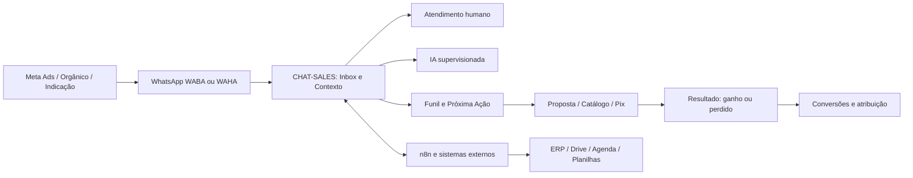

# Blueprint do Produto — CHAT-SALES

## 1. Definição

O CHAT-SALES é um sistema operacional comercial multi-tenant para empresas que usam o WhatsApp como canal de venda, atendimento ou agendamento.

Ele reúne conversa, contato, oportunidade, próxima ação, catálogo, proposta, cobrança, resultado comercial, atribuição e automações opcionais em uma única operação rastreável.

## 2. Problema central

Empresas vendem pelo WhatsApp, mas a operação normalmente fica fragmentada:

- conversas permanecem no telefone;
- contatos não viram registros comerciais úteis;
- oportunidades não têm responsável, prazo ou próxima ação;
- catálogo, proposta e cobrança ficam separados;
- o gestor não sabe o que converteu;
- integrações são construídas de forma artesanal;
- automações enviam mensagens sem contexto ou governança.

## 3. Promessa

> Transformar conversas do WhatsApp em uma operação comercial organizada, mensurável e assistida, sem tornar o trabalho do operador mais complexo.

## 4. Limites do produto

O CHAT-SALES serve empresas que vendem, atendem ou agendam pelo WhatsApp. Ele não pretende ser:

- ERP;
- sistema contábil;
- gerenciador completo de campanhas;
- plataforma genérica de automação;
- substituto irrestrito de CRM corporativo;
- robô autônomo que decide e envia tudo sem supervisão.

O n8n amplia o produto para processos específicos. Ele não detém a verdade de contatos, conversas, permissões ou resultados comerciais.

## 5. Arquitetura de valor

## 6. Módulos do produto

| Módulo | Resultado | Estado |
|---|---|---|
| Cockpit | atender conversas com contexto | `[IMPLEMENTADO]` |
| Contatos | ficha, edição, tags, observações e status | `[IMPLEMENTADO]` |
| Oportunidades | funil, card, movimentação e outcome | `[IMPLEMENTADO]` |
| Próxima ação | responsável, atividade, prazo e conclusão | `[IMPLEMENTADO]` |
| Radar | detectar conversas que pedem atenção | `[IMPLEMENTADO]` com decisão humana |
| Catálogo | produtos/serviços, preço, imagem e status | `[IMPLEMENTADO]` com UX em evolução |
| Propostas | composição e histórico comercial | `[IMPLEMENTADO]` |
| Pix | gerar cobrança e conferir liquidação | `[IMPLEMENTADO]`; provedor financeiro é configurável |
| WABA | canal oficial Meta | `[PARCIAL]` dependente de credenciais e Meta |
| WAHA | canal por sessão/QR | `[IMPLEMENTADO]` como alternativa operacional |
| Templates/Flows | modelos oficiais e fluxos WABA | `[PARCIAL]` |
| CAPI | devolver outcomes elegíveis à Meta | `[PARCIAL]`; precisa prova operacional por tenant |
| API e webhooks | extensão segura por sistemas externos | `[PARCIAL]` |
| n8n | automações específicas por negócio | `[PARCIAL]`, extensão opcional |
| IA | geração e apoio ao operador | `[PARCIAL]`, governada e provider-agnostic |

## 7. Princípios permanentes

1. **Poder invisível, simplicidade visível.**
2. Cada workspace representa uma empresa/cliente isolado.
3. Conversa não significa oportunidade; oportunidade não significa venda.
4. Efeito externo deve ser idempotente, auditável e reconciliável.
5. IA propõe; políticas e pessoas governam ações sensíveis.
6. Toda função comum pertence ao produto e nasce disponível para novos clientes.
7. Dados, credenciais, canais, catálogo e regras comerciais são individuais por workspace.
8. Nenhum cliente piloto gera hardcode no núcleo.
