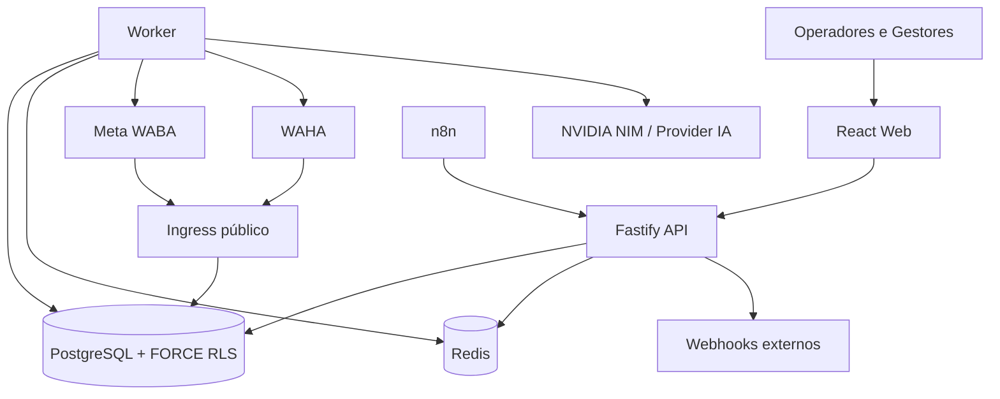
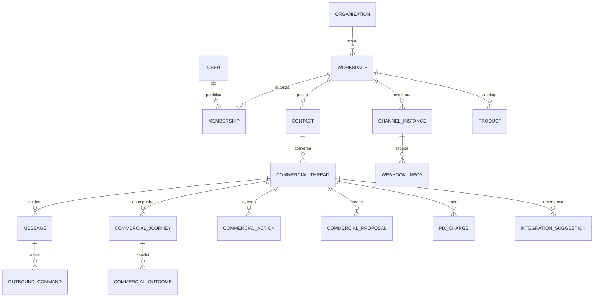
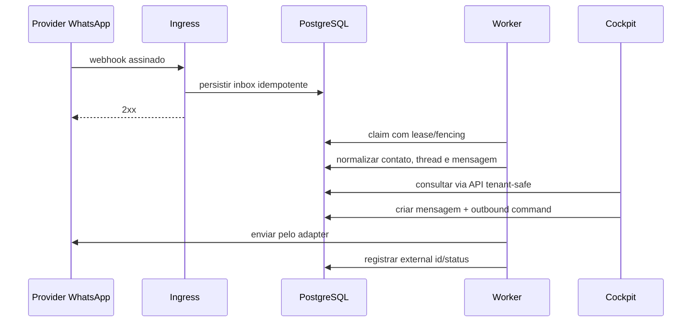

# Arquitetura e Modelo de Dados

## 1. Visão de contexto

## 2. Componentes

| Componente | Responsabilidade |
|---|---|
| `apps/web` | navegação, Cockpit, CRM e configurações |
| `apps/api` | contratos HTTP, autenticação, RBAC e orquestração |
| `apps/worker` | filas, envio, retry, reconciliação e tarefas assíncronas |
| `packages/domain` | entidades e invariantes independentes de provider |
| `packages/application` | casos de uso e portas |
| `packages/database` | migrations, transações tenant-safe e repositórios |
| `packages/contracts` | schemas e tipos compartilhados |
| `packages/auth` | identidade e autorização |
| `packages/observability` | logs, métricas e correlação |
| `packages/ui` | componentes e tokens reutilizáveis |

## 3. Contextos delimitados

- **Identity & Tenancy:** organizações, workspaces, usuários e memberships.
- **Channel Control Plane:** credenciais, instâncias e saúde de WABA/WAHA.
- **Messaging Data Plane:** ingress, inbox, mensagens, status e outbound.
- **Commercial Core:** contatos, threads, jornadas, oportunidades e outcomes.
- **Commercial Enablement:** catálogo, propostas, Pix e próximas ações.
- **Intelligence:** Radar, IA assistida, regras e evidências.
- **Acquisition Feedback:** atribuição e CAPI.
- **Integration Platform:** tokens, webhooks e n8n.
- **Operations:** auditoria, métricas, backup e suporte.

## 4. Entidades principais

## 5. Invariantes

1. Toda entidade pertencente ao cliente contém `workspace_id`.
2. A transação define contexto tenant antes de qualquer query protegida.
3. `FORCE ROW LEVEL SECURITY` protege dados mesmo contra erro de repositório.
4. Webhook aceito é persistido antes do processamento.
5. Efeito externo nasce de registro transacional em outbox.
6. Timeout ambíguo vai para reconciliação; não é repetido cegamente.
7. Segredo é resolvido no limite do adapter e nunca volta no DTO.
8. Provider WhatsApp, IA ou pagamento não entra na regra central.
9. Recurso global é habilitado no provisionamento; configuração e dados são por tenant.

## 6. Fluxo de mensagem

## 7. Estratégia de escala

- escala inicial vertical no VPS;
- API e worker stateless sempre que possível;
- concorrência por fila, lease e `SKIP LOCKED`;
- armazenamento de mídia fora do banco quando volume justificar;
- particionamento por data para inbox, mensagens e auditoria quando necessário;
- réplica de leitura somente após medir gargalo;
- um WAHA compartilhado pode hospedar múltiplas sessões isoladas; WABA permanece por credencial/tenant.
