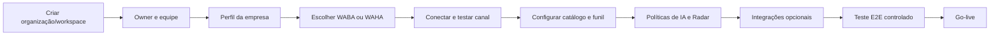

# Multi-tenancy, Onboarding e Planos

## 1. Modelo

- **Organização:** entidade contratante que pode possuir um ou mais workspaces.
- **Workspace:** ambiente operacional isolado de uma empresa, unidade ou marca.
- **Membership:** vínculo de usuário com papel e permissões.
- **Canal:** instância WhatsApp pertencente ao workspace.

## 2. O que é padrão global

Todo novo workspace recebe:

- contatos e funil;
- próxima ação;
- Radar governado;
- catálogo, propostas e Pix;
- configurações de canal;
- área de integração;
- auditoria e isolamento.

Planos comerciais podem limitar volume ou liberar módulos, mas não devem criar versões divergentes do núcleo.

## 3. O que é individual

- identidade visual e dados da empresa;
- usuários e papéis;
- credenciais e números WhatsApp;
- catálogo e preços;
- chave e política Pix;
- funil e regras de SLA;
- templates;
- prompts, conhecimento e autonomia da IA;
- integrações e destinos de webhook;
- retenção, limites e plano contratado.

## 4. Jornada de onboarding

## 5. Gate de ativação

Um workspace só fica operacional quando:

- owner válido existe;
- canal apresenta saúde;
- ingress e outbound foram testados;
- permissões foram revisadas;
- política de retenção está definida;
- primeira conversa controlada percorreu o Cockpit;
- rollback/revogação do canal está disponível.

## 6. Administração

O painel interno deve permitir:

- criar, suspender e reativar workspace;
- trocar plano e limites;
- habilitar/desabilitar módulos;
- consultar saúde sem ler conversa desnecessariamente;
- emitir acesso de suporte temporário e auditado;
- rotacionar integrações;
- exportar ou eliminar dados conforme LGPD.

## 7. Diretriz comercial

O cliente compra o resultado operacional do CHAT-SALES. WAHA, Meta, NVIDIA, n8n, armazenamento e serviços de terceiros devem aparecer no contrato como componentes, limites ou custos variáveis quando aplicável.
