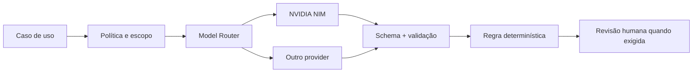

# IA, Radar e Governança

## 1. Objetivo

Usar IA para reduzir trabalho cognitivo do operador sem transferir decisões sensíveis a um modelo probabilístico.

## 2. Casos de uso

| Caso | Saída | Autonomia inicial |
|---|---|---|
| resumir conversa | resumo com fatos e pendências | automática, sem efeito externo |
| sugerir resposta | rascunho | exige revisão |
| detectar oportunidade | sugestão + evidência | exige decisão |
| gerar template WABA | rascunho validado | exige edição/submissão |
| classificar intenção | classe + confiança | pode organizar fila; não fecha venda |
| recomendar próxima ação | ação, responsável e prazo sugeridos | exige aceite |
| consultar conhecimento | resposta fundamentada | citar fonte e permitir fallback |

## 3. Arquitetura provider-agnostic



NVIDIA Nemotron pode ser o provider principal, mas identificador de modelo, endpoint e chave são configuração. Nenhuma regra de negócio depende do nome de um modelo.

## 4. Seleção de modelo

- modelo pequeno/rápido: classificação, roteamento e extração simples;
- modelo intermediário: resumo, sugestão e template;
- modelo avançado: análise complexa ou baixa confiança;
- visão/documentos: modelo multimodal específico quando necessário;
- fallback determinístico/humano quando o provider falhar.

## 5. Contrato obrigatório

Toda resposta programática deve ser validada por schema, contendo quando aplicável:

```json
{
  "result": {},
  "confidence": 0.0,
  "evidence": [],
  "missingInformation": [],
  "model": "provider/model",
  "promptVersion": "v1"
}
```

## 6. Radar

O Radar é padrão para todos os workspaces, mas governado:

- avalia candidatos elegíveis;
- respeita cooldown e versão da regra;
- rejeita origem desatualizada;
- cria sugestão idempotente;
- aceita ou dispensa com versão de estado;
- nunca envia mensagem no aceite;
- pode ser desligado por tenant.

## 7. Segurança da IA

- entrada do usuário é dado, não instrução de sistema;
- prompts são versionados;
- ferramentas usam allowlist e schemas estritos;
- PII é minimizada;
- saída inválida falha fechada;
- custo, latência e erro são medidos;
- logs não armazenam segredos;
- avaliações cobrem alucinação, injection e ação indevida.

## 8. Métricas

- aceitação e edição dos rascunhos;
- taxa de sugestão inválida;
- confiança versus acerto humano;
- latência p50/p95;
- custo por workspace e caso de uso;
- falha/fallback por modelo;
- incidentes de policy violation.
