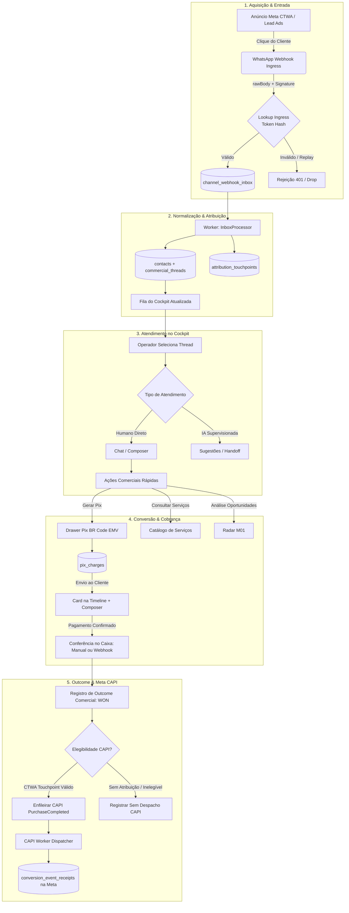
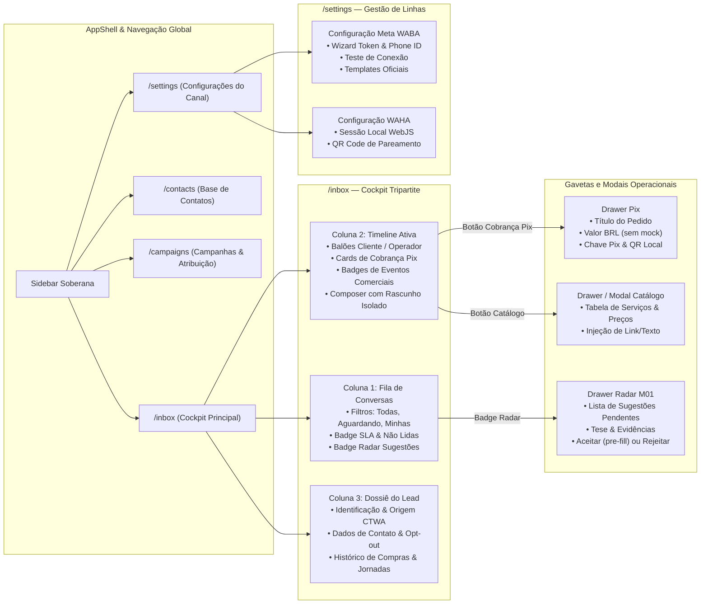
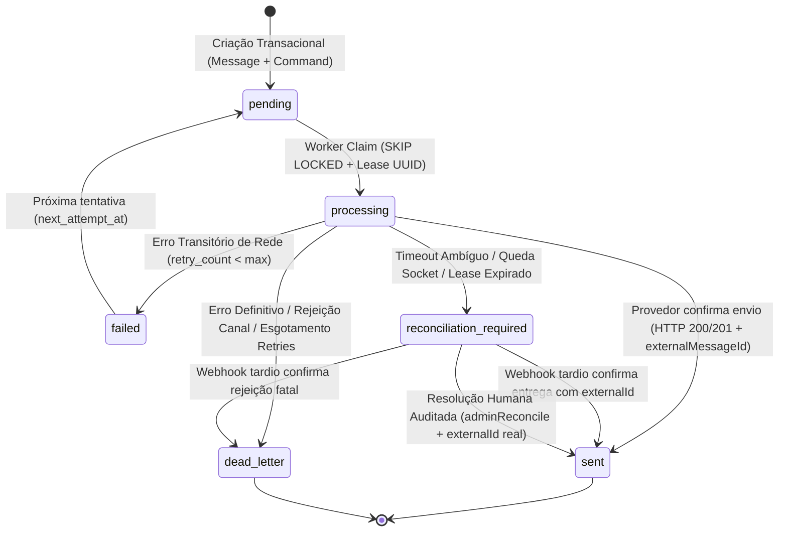
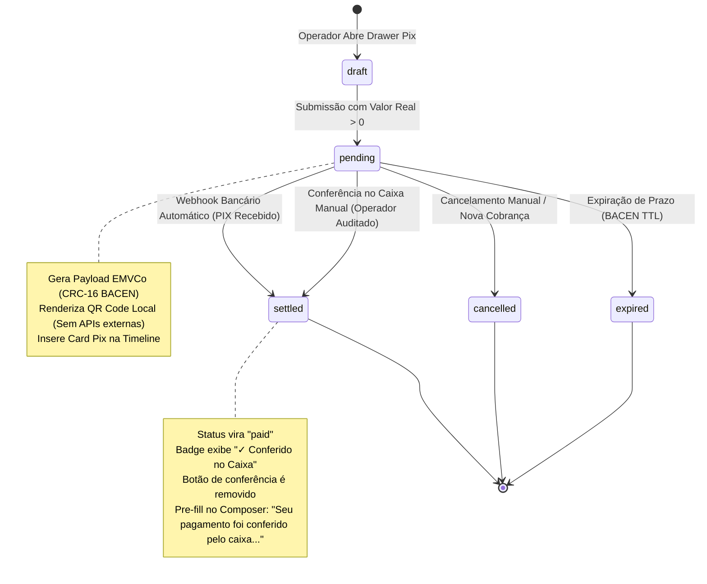
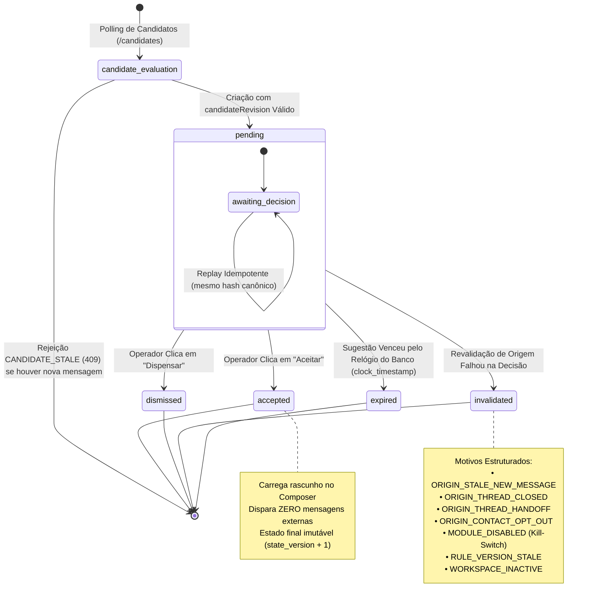

# SOS SALES V3 — FLUXO DO APP, JORNADAS E MÁQUINAS DE ESTADO

> **MCT OS v2.0 | Francisco Rios | MCT LTDA | Chapecó, BR**  
> **Filosofia:** *Poder invisível, simplicidade visível. Truth in Data.*  
> **Stack:** React 19 + Vite, Fastify 5, PostgreSQL 16 (FORCE RLS), Redis 7 / BullMQ, WABA / WAHA.  
> **Status:** Referência Canônica de Navegação, Experiência e Transições de Estado.

---

## 1. Visão Geral da Arquitetura de Fluxos

O **SOS Sales V3 (CHAT-SALES)** opera em três camadas coordenadas de fluxo:

```text
┌────────────────────────────────────────────────────────────────────────┐
│  NÍVEL 1: MACRO-FLUXO DE NEGÓCIO (AQUISIÇÃO → CONVERSÃO → RETORNO)    │
│  Meta Ads (CTWA) → WhatsApp Ingress → Cockpit → Outcome → Meta CAPI    │
└───────────────────────────────────┬────────────────────────────────────┘
                                    │
┌───────────────────────────────────▼────────────────────────────────────┐
│  NÍVEL 2: FLUXO DE NAVEGAÇÃO DO COCKPIT (HUMANO / OPERACIONAL)         │
│  AppShell → Inbox → Thread Ativa → Drawers (Pix, Catálogo, Radar)      │
└───────────────────────────────────┬────────────────────────────────────┘
                                    │
┌───────────────────────────────────▼────────────────────────────────────┐
│  NÍVEL 3: MÁQUINAS DE ESTADO DETERMINÍSTICAS (BACKEND TRANSACIONAL)    │
│  Outbox (Lease/Fencing) │ Cobrança Pix │ Radar M01 │ Handoff IA/Humano │
└────────────────────────────────────────────────────────────────────────┘
```

---

## 2. Nível 1: Macro-Fluxo de Negócio de Ponta a Ponta

Este fluxo governa o ciclo completo com prova: nenhum lead é perdido, nenhuma venda é inventada e nenhuma conversão é disparada sem recibo.



---

## 3. Nível 2: Mapa de Navegação da Interface (Cockpit)

O Cockpit segue a diretriz **Bounded Containers** e navegação com sidebar escura estrutural (`#0B132B`) e área de trabalho limpa (`#F8FAFC`).



---

## 4. Nível 3: Máquinas de Estado Transacionais

### 4.1 Máquina de Estados da Mensageria Outbox (`outbound_commands`)

Garante **zero duplicação de mensagens**, tratamento governado de timeouts ambíguos e isolamento de fila via `FOR UPDATE SKIP LOCKED`.



---

### 4.2 Máquina de Estados da Cobrança Pix (`pix_charges`)

Isola estritamente a gestão financeira de efeitos colaterais de marketing, suportando múltiplas cobranças coexistentes e conferência no caixa.



---

### 4.3 Máquina de Estados do Radar de Oportunidades M01 (`integration_suggestions`)

Governa o ciclo de vida de recomendações da inteligência sem permitir automações cegas (zero outbound na aceitação).



---

## 5. Matriz de Estados Honestos por Tela (Truth in Data)

Em conformidade com a filosofia **MCT OS**, nenhuma tela utiliza dados fictícios ou simulações:

| Rota / Componente | Papel Mínimo | Estado Normal | Estado Vazio (`empty`) | Estado Degradado / Erro |
| :--- | :--- | :--- | :--- | :--- |
| **`/inbox` (Fila)** | `operator` | Lista de conversas ordenadas por `last_message_at` | *"Nenhuma conversa pendente no momento"* | Alerta de desconexão do provedor (WAHA/WABA) sem mascarar como fila limpa |
| **`/inbox` (Timeline)** | `operator` | Mensagens reais com status (enviado, entregue, lido) | *"Selecione uma conversa para iniciar o atendimento"* | Balão vermelho com código de erro sanitizado e ação `Retry` |
| **Drawer Pix** | `operator` | Campos de Título e Valor BRL iniciam limpos (`""`) | Botão de envio desabilitado enquanto valor for nulo/vazio | Validação de chave Pix inválida ou falha de conexão |
| **Drawer Radar** | `operator` | Cards de recomendação com evidências reais | *"Nenhuma recomendação pendente para esta conversa"* | Aviso se o módulo Radar estiver desativado no workspace |
| **`/contacts`** | `operator` | Tabela paginada com telefone E.164 e opt-out | *"Nenhum contato cadastrado ainda"* | Falha de carregamento com botão de nova tentativa |
| **`/campaigns`** | `admin` | Tabela de Touchpoints CTWA com `ad_id` e métricas | *"Nenhuma campanha com tráfego registrado"* | Diagnóstico de permissão do token Meta Ads |
| **`/settings`** | `admin` | Formulários de configuração e saúde de canal | Linha não configurada exibe Wizard passo a passo | Indicador de erro HTTP / Token expirado |

---

## 6. Mapa de Evidências Visuais Auditadas

As telas e fluxos documentados acima foram verificados em testes reais reproduzíveis no repositório:

| Arquivo de Evidência | Tela / Fluxo Comprovado |
| :--- | :--- |
| [`docs/audits/haven-cockpit-inbox.png`](file:///Users/franciscotaveira.ads/Downloads/FT/CHAT-SALES/docs/audits/haven-cockpit-inbox.png) | Fila de conversas, badges de não lidas e visual tripartite do Cockpit |
| [`docs/audits/haven-chat-active.png`](file:///Users/franciscotaveira.ads/Downloads/FT/CHAT-SALES/docs/audits/haven-chat-active.png) | Conversa ativa com Mariana Souza, balões e timeline em tempo real |
| [`docs/audits/haven-chat-pix-drawer.png`](file:///Users/franciscotaveira.ads/Downloads/FT/CHAT-SALES/docs/audits/haven-chat-pix-drawer.png) | Drawer Pix aberto em estado limpo (sem valores mockados) |
| [`docs/audits/e1-pix-two-charges-distinct-states.png`](file:///Users/franciscotaveira.ads/Downloads/FT/CHAT-SALES/docs/audits/e1-pix-two-charges-distinct-states.png) | Coexistência de duas cobranças Pix com estados independentes |
| [`docs/audits/e1-cashier-draft-persisted.png`](file:///Users/franciscotaveira.ads/Downloads/FT/CHAT-SALES/docs/audits/e1-cashier-draft-persisted.png) | Rascunho de conferência de caixa preenchido e persistido entre trocas de aba |
| [`docs/audits/radar-drawer-open.png`](file:///Users/franciscotaveira.ads/Downloads/FT/CHAT-SALES/docs/audits/radar-drawer-open.png) | Drawer do Radar M01 exibindo sugestões pendentes |
| [`docs/audits/radar-draft-accepted.png`](file:///Users/franciscotaveira.ads/Downloads/FT/CHAT-SALES/docs/audits/radar-draft-accepted.png) | Aceite de sugestão preenchendo o composer com zero outbound automático |
| [`docs/audits/haven-waba-settings-pix.png`](file:///Users/franciscotaveira.ads/Downloads/FT/CHAT-SALES/docs/audits/haven-waba-settings-pix.png) | Tela de configurações WABA e chave Pix operacional |
| [`docs/audits/live-test/`](file:///Users/franciscotaveira.ads/Downloads/FT/CHAT-SALES/docs/audits/live-test/) | Suite completa da jornada do operador (do login à venda ganha e auditoria) |
