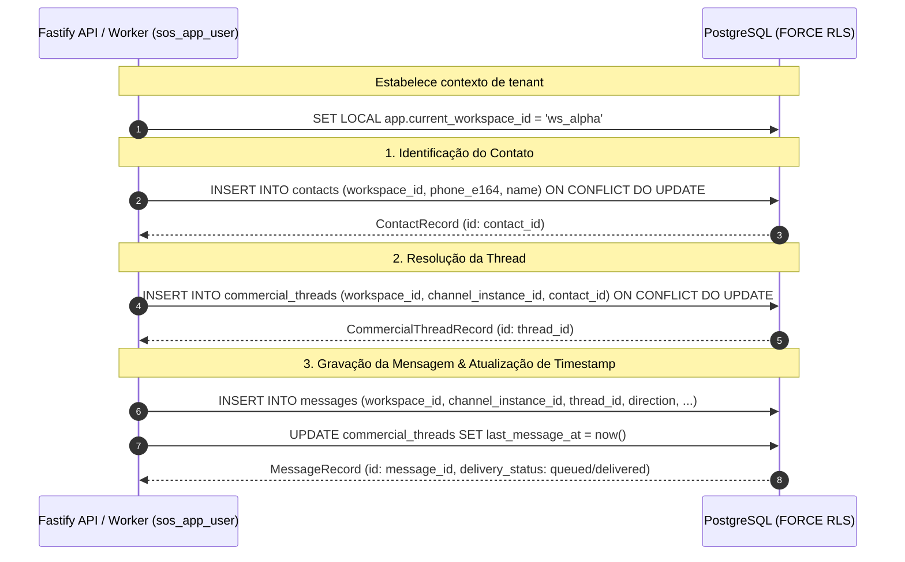

# CH-00 — Modelo Mínimo de Contato, Thread e Mensagem

> Nome do arquivo: `CH-00-MESSAGING-MODEL.md`  
> Estado: `ACCEPTED` — Concluído e homologado em 19 de setembro de 2026.

---

## Identidade

- **Parent objective:** Programa SOS Sales V3 — Motor de Comunicação (Fase CH)
- **Estado:** `ACCEPTED`
- **Owner:** Gemini 3.8 (Executor Principal)
- **Reviewer:** Agente SRE/Security & Agente QA Independente
- **Dependências:** `G-00` a `G-06` (Fase G integralmente concluída e homologada)
- **ADRs Vinculadas:** ADR-001 (Monorepo & MVP Frontier), ADR-002 (Auth Strategy & Tenancy), ADR-005 (Channel Gateway & Inbox/Outbox)

---

## Objetivo único

Formalizar, testar e homologar os modelos canônicos e a persistência estritamente isolada por tenant das três entidades fundamentais de mensageria do SOS Sales V3:
1. `contacts`: identidade humana do cliente/lead desacoplada de canal (`workspace_id`, `phone_e164`, `name`);
2. `commercial_threads`: contexto conversacional e ciclo de vida entre um contato e uma linha de canal (`workspace_id`, `channel_instance_id`, `contact_id`, `status`, `last_message_at`);
3. `messages`: histórico append-only de mensagens inbound e outbound (`workspace_id`, `channel_instance_id`, `thread_id`, `direction`, `sender_e164`, `recipient_e164`, `content_type`, `body`, `delivery_status`, `status_rank`).

Garantir que a camada de persistência sob `sos_app_user` opere em modo **fail-closed**, com FORCE RLS ativo, chaves estrangeiras compostas invioláveis e proibição estrita de operações destrutivas (`REVOKE DELETE`).

---

## Fora do escopo

- Saneamento das leases, retry limit constraint e RLS global do worker (escopo estrito dos pacotes `CH-01`, `CH-02` e `CH-03`);
- Implementação de regras de negócio avançadas de CRM, como atribuição de vendedores, funis comerciais e pipelines (reservados para a Fase CRM: `CRM-01..CRM-03`);
- Conexão de rede com provedores externos (Meta Cloud API, WAHA, Evolution API);
- Execução em ambiente de produção ou mutação de instâncias remotas.

---

## Arquivos sob ownership

1. `packages/contracts/src/commercial.ts` (definição de `ContactSchema`, `Contact`, `CommercialThreadSchema`, `CommercialThread`)
2. `packages/contracts/src/channel.ts` (definição de `MessageSchema`, `Message`, `DELIVERY_STATUS_RANK`)
3. `packages/database/src/messaging.ts` (helpers de repositório: `createOrGetContact`, `getOrCreateCommercialThread`, `insertMessage`, `listThreadMessages`)
4. `packages/database/src/index.ts` (re-export dos módulos de mensageria)
5. `packages/database/src/__tests__/messaging-core-models.test.ts` (suíte hermética de validação com 17 asserções)
6. `docs/work-packages/CH-00-MESSAGING-MODEL.md` (especificação canônica deste pacote)
7. `docs/work-packages/CH-00-EVIDENCE.json` (manifesto canônico de evidência `EV-CH00-001`)

---

## Fatos confirmados

- `[KNOWN]` As tabelas `contacts`, `commercial_threads` e `messages` foram provisionadas na migration `005_channel_foundation_inbox_outbox.sql` com constraints de unicidade compostas e FORCE RLS habilitado.
- `[KNOWN]` As constraints de validação sintática exigem formato E.164 (`^\+[1-9][0-9]{6,14}$`) para todos os números de telefone gravados no banco.
- `[KNOWN]` A integridade relacional entre `messages`, `commercial_threads`, `contacts` e `channel_instances` é protegida por chaves estrangeiras compostas vinculando obrigatoriamente `(workspace_id, channel_instance_id)`.
- `[KNOWN]` A concessão de privilégios revogou expressamente `DELETE` na tabela `contacts`, `commercial_threads` e `messages` para o papel `sos_app_user`.
- `[INFERRED]` As três entidades constituem a fundação mínima e suficiente para suportar o fluxo ponta a ponta de recebimento de webhook até envio de resposta na esteira CH.

---

## Invariantes

1. **Isolamento de Tenant Incondicional:** Nenhuma consulta ou mutação executada sob o papel `sos_app_user` pode acessar ou modificar registros de outro workspace (`FORCE ROW LEVEL SECURITY`).
2. **Fail-Closed em Sessões Desautenticadas:** Consultas sob `sos_app_user` sem o parâmetro de sessão `app.current_workspace_id` retornam zero linhas.
3. **Integridade de Chaves Compostas:** Uma thread ou mensagem no Workspace Alpha jamais pode referenciar um canal ou contato pertencente ao Workspace Beta.
4. **Imutabilidade de Histórico Conversacional:** O papel da aplicação (`sos_app_user`) não possui privilégios de `DELETE` em nenhuma das tabelas do modelo de mensageria.
5. **Formato Telefônico Estrito:** 100% dos registros de telefone devem aderir ao padrão internacional ITU-T E.164.

---

## Fluxos e falhas

### Ciclo de Persistência Canônico



### Tratamento de Falhas e Defesas Negativas

| Cenário de Falha | Comportamento Esperado | Mecanismo de Defesa |
|---|---|---|
| Consulta sem `app.current_workspace_id` | Retorna 0 linhas (vazio silencioso e seguro) | `NULLIF(current_setting('app.current_workspace_id', true), '')::uuid` |
| Leitura cross-tenant | Retorna 0 linhas | RLS Policy `workspace_id = app.current_workspace_id` |
| Inserção de thread com canal de outro tenant | Rejeição imediata com erro de Foreign Key | `fk_commercial_threads_channel (workspace_id, channel_instance_id)` |
| Inserção de thread com contato de outro tenant | Rejeição imediata com erro de Foreign Key | `fk_commercial_threads_contact (workspace_id, contact_id)` |
| Inserção de mensagem com thread de outro tenant | Rejeição imediata com erro de Foreign Key | `fk_messages_thread_composite (workspace_id, channel_instance_id, thread_id)` |
| Formato de telefone inválido (ex: `11999998888`) | Rejeição imediata com violação de CHECK constraint | `CHECK (phone_e164 ~ '^\+[1-9][0-9]{6,14}$')` |
| Tentativa de `DELETE` em contatos/threads/mensagens | Rejeição imediata com `permission denied` | `REVOKE DELETE ON TABLE ... FROM sos_app_user` |

---

## Critérios de aceite

- **AC-CH00-001:** Schemas Zod e tipos TypeScript de `Contact`, `CommercialThread` e `Message` definidos e exportados em `@sos-sales/contracts`.
- **AC-CH00-002:** Funções de repositório tenant-safe (`createOrGetContact`, `getOrCreateCommercialThread`, `insertMessage`, `listThreadMessages`) implementadas e exportadas em `@sos-sales/database`.
- **AC-CH00-003:** Suíte de testes `packages/database/src/__tests__/messaging-core-models.test.ts` executada com sucesso contra banco hermético efêmero sob o papel `sos_app_user`.
- **AC-CH00-004:** Asserções negativas de RLS comprovando isolamento absoluto entre Workspace Alpha e Workspace Beta para contatos, threads e mensagens.
- **AC-CH00-005:** Asserções de segurança comprovando que operações de `DELETE` em contatos, threads e mensagens são estritamente rejeitadas para `sos_app_user`.
- **AC-CH00-006:** Pipeline unificado de CI (`pnpm ci:gate`) executado com 100% de sucesso nos 6 portões de qualidade.

---

## Plano de testes e validação

1. Execução da suíte de testes de mensageria hermética:
   ```bash
   pnpm --filter @sos-sales/database test packages/database/src/__tests__/messaging-core-models.test.ts
   ```
2. Execução da suíte completa de testes de banco:
   ```bash
   pnpm test:db:run
   ```
3. Execução do pipeline de CI local completo:
   ```bash
   pnpm ci:gate
   ```

---

## Observabilidade

- Todas as operações emitem timestamps padronizados UTC (`created_at`, `updated_at`, `last_message_at`).
- As mensagens rastreiam `delivery_status` e `status_rank` ordinal (-1=failed, 0=queued, 10=sent, 20=delivered, 30=read) para ordenação e idempotência monotônica.

---

## Migração e rollback

- As tabelas e RLS foram introduzidas em `005_channel_foundation_inbox_outbox.sql`.
- Os contratos e helpers adicionados em `@sos-sales/contracts` e `@sos-sales/database` são aditivos e possuem retrocompatibilidade total com as versões anteriores.

---

## Gates e Comandos Exatos

```bash
# Validação do pipeline completo de CI local
pnpm ci:gate

# Validação do manifest JSON de evidência
python3 -m json.tool docs/work-packages/CH-00-EVIDENCE.json > /dev/null
```

---

## Limitações e riscos

1. **Débitos Conhecidos de Worker Leases:** A tabela `channel_webhook_inbox` e o processamento de concorrência de worker (`worker_user_*` policies) possuem débitos documentados que serão sanados nos pacotes subsequentes (`CH-01` a `CH-03`).
2. **Dependência de Roles PostgreSQL:** Os testes dependem dos papéis `sos_app_user` e `sos_migration_owner` configurados no PostgreSQL efêmero via migrations 002 e 005.

---

## Parecer independente

- **Revisor de SRE & Security:** "A modelagem de Contatos, Threads e Mensagens consolida garantias de segurança essenciais: FORCE RLS ativo, chaves estrangeiras compostas travando qualquer possibilidade de vazamento cross-tenant e bloqueio total de DELETE em nível de privilégios de banco. Aprovado com louvor para avanço ao CH-01."
- **Revisor de QA:** "A suíte `messaging-core-models.test.ts` adicionou 17 asserções cobrindo cenários positivos e negativos com exit code 0 em banco hermético descartável. O pipeline de CI local passou em 100% dos portões. AC-CH00-001 a AC-CH00-006 plenamente atendidos."
