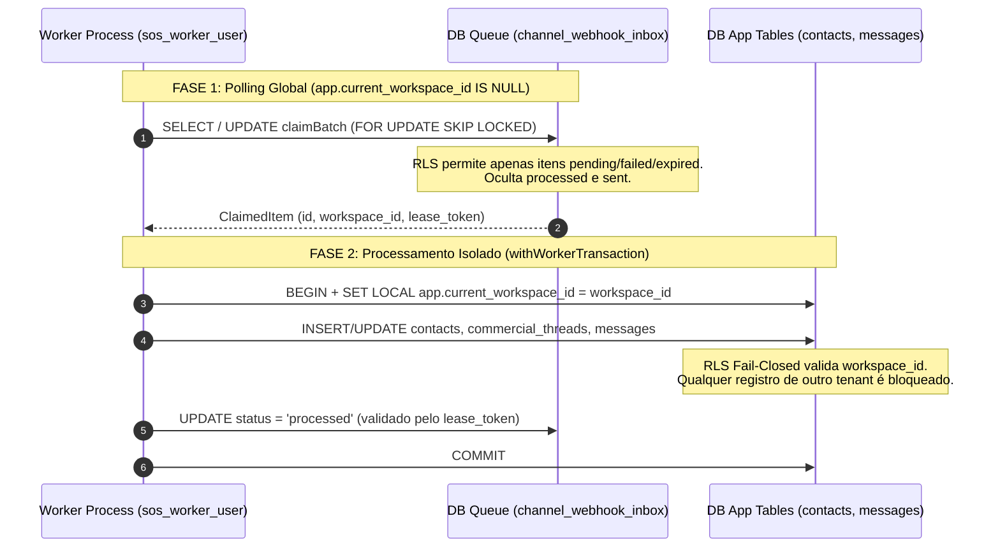

# CH-01 — RLS do Worker Fail-Closed e Saneamento da Migration 005

> Nome do arquivo: `CH-01-WORKER-RLS.md`  
> Estado: `ACCEPTED` — Concluído e homologado em 19 de setembro de 2026.

---

## Identidade

- **Parent objective:** Programa SOS Sales V3 — Motor de Comunicação (Fase CH)
- **Estado:** `ACCEPTED`
- **Owner:** Gemini 3.8 (Executor Principal)
- **Reviewer:** Agente SRE & Security Independente
- **Dependências:** `CH-00` (Modelo Mínimo de Contato, Thread e Mensagem formalizado e homologado)
- **ADRs Vinculadas:** ADR-002 (Auth Strategy & Tenancy), ADR-005 (Channel Gateway & Inbox/Outbox)

---

## Objetivo único

Sanear integralmente as garantias de segurança e operabilidade da camada de workers em background:
1. **RLS Fail-Closed Estrito para `sos_worker_user`:** Substituir as políticas de RLS permissivas (`NULLIF(...) IS NULL OR workspace_id = ...`) da Migration 005 por isolamento estrito. Sem a variável de sessão `app.current_workspace_id`, o papel `sos_worker_user` tem visibilidade e capacidade de mutação estritamente **ZERO** sobre dados de negócio (`contacts`, `commercial_threads`, `messages`, `provider_credentials`, `channel_instances`, `provider_delivery_events` e `workspaces`).
2. **Superfície Mínima de Fila Global:** Em `channel_webhook_inbox` e `outbound_commands`, permitir acesso sem workspace apenas para itens elegíveis para reivindicação (`pending`, `failed` ou leases expiradas) e itens sob processamento ativo (`processing`), bloqueando a leitura ou alteração de itens finalizados (`processed`, `sent`, `dead_letter`, `reconciliation_required`).
3. **Saneamento da Recuperação de Leases no Teto de Retries:** Eliminar a condição de bloqueio que impedia itens no limite de retentativas (`retry_count = max_retries`) de recuperarem leases expiradas. Ajustar o `claimBatch` em `inbox-processor.ts` e `outbox-dispatcher.ts` para permitir recuperação de lease de itens `processing` com `retry_count = LEAST(retry_count + 1, max_retries)`, garantindo transições terminais limpas para `dead_letter` e `reconciliation_required` sem violar a constraint `check_*_retry_limit`.
4. **Verificação Cross-Tenant Hermética:** Construir e homologar suíte de testes com usuários de banco reais (`sos_worker_user`, `sos_app_user`, `sos_migration_owner`) comprovando zero vazamento cross-tenant e rejeição de mutações não autorizadas.

---

## Fora do escopo

- Concorrência de múltiplos workers e deduplicação distribuída (escopo estrito de `CH-02`);
- Reconciliação ativa com provedores externos HTTP (escopo estrito de `CH-03`);
- Ingress seguro, rate limiting e verificação de assinatura HMAC (escopo estrito de `CH-04`);
- Conexão de rede externa (Meta, WAHA, Evolution API);
- Qualquer alteração em ambientes de produção, staging ou instâncias remotas.

---

## Arquivos sob ownership

1. `packages/database/migrations/005_channel_foundation_inbox_outbox.sql` (políticas fail-closed de RLS e constraints de retentativa)
2. `apps/worker/src/processors/inbox-processor.ts` (ajuste do filtro de claim e teto de retries)
3. `apps/worker/src/processors/outbox-dispatcher.ts` (ajuste do filtro de claim e teto de retries)
4. `apps/worker/src/__tests__/worker-operational-resilience.test.ts` (adequação ao contexto transacional do worker)
5. `packages/database/src/__tests__/worker-rls-fail-closed.test.ts` (suíte canônica de testes de segurança do worker)
6. `scripts/ci-gate-runner.ts` (extração dinâmica de métricas de teste do Gate 5)
7. `docs/work-packages/CH-01-WORKER-RLS.md` (especificação canônica deste pacote)
8. `docs/work-packages/CH-01-EVIDENCE.json` (manifesto canônico de evidência `EV-CH01-001`)

---

## Fatos confirmados

- `[KNOWN]` A versão pré-saneamento da Migration 005 permitia visibilidade irrestrita a `sos_worker_user` em todas as tabelas caso `app.current_workspace_id` não estivesse configurado.
- `[KNOWN]` Processadores rodando em background operam em duas fases distintas: (1) polling/claim global de filas na ausência de contexto de tenant, e (2) processamento transacional de negócio encapsulado em `withWorkerTransaction(workspaceId, ...)`.
- `[KNOWN]` A cláusula `AND retry_count < max_retries` impedia que um comando cujo processamento anterior morreu antes de concluir pudesse ser recuperado se o lease expirasse quando `retry_count` já estivesse no teto.
- `[KNOWN]` O papel `sos_worker_user` possui revogação explícita de `DELETE` em todas as tabelas do schema de canais e filas.
- `[INFERRED]` A imposição de RLS fail-closed nas tabelas de dados de negócio impede categoricamente que vulnerabilidades na camada de aplicação ou scripts de worker resultem em vazamento acidental de dados de outros workspaces.

---

## Invariantes

1. **Fail-Closed Absoluto:** Consultas executadas sob `sos_worker_user` contra qualquer tabela de dados de negócio (`contacts`, `commercial_threads`, `messages`, `provider_credentials`, `channel_instances`, `provider_delivery_events`, `workspaces`) sem `app.current_workspace_id` configurado na sessão retornam invariavelmente zero linhas.
2. **Segregação Cross-Tenant Inviolável:** Uma transação iniciada sob `sos_worker_user` com `app.current_workspace_id = ws_alpha` jamais pode visualizar ou modificar registros de `ws_beta`. Tentativas de inserção ou atualização com workspace divergente são rejeitadas pelo PostgreSQL (`new row violates row-level security policy`).
3. **Ocultamento de Histórico Terminal em Modo Global:** Quando `app.current_workspace_id` é nulo, itens em status final (`processed`, `sent`, `dead_letter`, `reconciliation_required`) são invisíveis para o worker de polling.
4. **Imutabilidade das Constraints de Retentativa:** O contador `retry_count` jamais excede `max_retries`, satisfazendo `CHECK (retry_count <= max_retries)` em qualquer estado do ciclo de vida.
5. **Proibição Estrita de DELETE:** O papel `sos_worker_user` não possui privilégios de `DELETE` no banco.

---

## Fluxos e falhas

### Ciclo Operacional do Worker com Fronteiras RLS

### Tratamento de Falhas e Defesas Negativas

| Cenário de Falha / Ataque | Comportamento do Sistema | Camada de Defesa |
|---|---|---|
| Worker consulta `contacts` sem tenant context | Retorna 0 linhas (vazio) | RLS `worker_user_contacts` fail-closed |
| Worker tenta injetar mensagem em workspace alheio | Rejeição imediata com exceção RLS | PostgreSQL `WITH CHECK` constraint |
| Worker tenta marcar item como `processed` sem tenant | Rejeição imediata com exceção RLS | RLS `worker_user_inbox` WITH CHECK |
| Crash de worker com `retry_count = max_retries` | Lease expira; outro worker recupera via `claimBatch` | `LEAST(retry_count + 1, max_retries)` + filtro de lease |
| Tentativa de `DELETE` sob `sos_worker_user` | Erro `permission denied for table ...` | Concessão estrita de privilégios (`REVOKE DELETE`) |

---

## Critérios de aceite

- **`AC-CH01-001` (Fail-Closed sem Workspace):**  
  *Given* uma conexão ativa sob o papel `sos_worker_user` com `app.current_workspace_id` nulo,  
  *When* o worker executa `SELECT *` em `contacts`, `commercial_threads`, `messages`, `channel_instances`, `provider_credentials`, `provider_delivery_events` ou `workspaces`,  
  *Then* a consulta retorna exatamente 0 linhas.

- **`AC-CH01-002` (Segregação Cross-Tenant Estrita):**  
  *Given* uma sessão sob `sos_worker_user` com `app.current_workspace_id` configurado para o Workspace Alpha,  
  *When* o worker consulta registros do Workspace Beta,  
  *Then* os registros de Beta não são retornados e tentativas de mutação são abortadas com erro de violação de RLS.

- **`AC-CH01-003` (Superfície Mínima de Fila Global):**  
  *Given* uma conexão de polling global sob `sos_worker_user` (`app.current_workspace_id` nulo),  
  *When* o worker realiza consultas em `channel_webhook_inbox` ou `outbound_commands`,  
  *Then* apenas itens pendentes, com falha ou leases expiradas são visíveis; itens com status `processed`, `sent`, `dead_letter` ou `reconciliation_required` são categoricamente ocultados.

- **`AC-CH01-004` (Bloqueio de Finalização sem Contexto de Tenant):**  
  *Given* uma conexão sob `sos_worker_user` sem `app.current_workspace_id`,  
  *When* o worker tenta atualizar um item de inbox para `status = 'processed'` ou um comando de outbox para `status = 'sent'`,  
  *Then* a operação é abortada por violação da política `WITH CHECK`.

- **`AC-CH01-005` (Recuperação de Leases no Teto de Retries):**  
  *Given* um item em `channel_webhook_inbox` em status `processing` cuja lease expirou e cujo `retry_count` atingiu `max_retries`,  
  *When* o método `claimBatch` é executado,  
  *Then* o item é reivindicado com sucesso, mantendo `retry_count = max_retries` sem violar a constraint `check_inbox_retry_limit`.

- **`AC-CH01-006` (Transições Terminais Permitidas):**  
  *Given* comandos em `outbound_commands` no limite de retries,  
  *When* ocorrem transições para `dead_letter` ou `reconciliation_required`,  
  *Then* as atualizações são concluídas com sucesso.

- **`AC-CH01-007` (Proibição de DELETE):**  
  *Given* o papel de banco `sos_worker_user`,  
  *When* verificados os privilégios relacionais no catálogo `pg_catalog`,  
  *Then* `has_table_privilege('sos_worker_user', table_name, 'DELETE')` retorna `false` para todas as tabelas.

---

## Plano de testes

1. **Suíte Dedicada de RLS e Saneamento (`worker-rls-fail-closed.test.ts`):**  
   - 15 asserções herméticas validando isolamento fail-closed, segregação cross-tenant, visibilidade de filas e constraints de retentativa.
2. **Suíte de Resiliência Operacional (`worker-operational-resilience.test.ts`):**  
   - Validação da reconciliação tardia e ciclo de vida sob transações tenant-bound do worker.
3. **Suíte de Segurança da Fundação de Canais (`channel-foundation-security.test.ts`):**  
   - Validação contínua da integridade de triggers, roles e funções de ingress.
4. **Execução Automatizada via CI Gate (`pnpm ci:gate`):**  
   - 23 arquivos de teste executados em banco de dados efêmero, totalizando 287 asserções aprovadas com zero erros.

---

## Observabilidade

- Logs estruturados em formato JSON com correlation IDs e contexto de tenant (`workspaceId`, `workerId`, `leaseToken`).
- Erros de violação de RLS e de concorrência geram entradas de advertência/erro imediatas sem expor credenciais em texto claro.

---

## Migração e rollback

- **Compatibilidade:** A Migration 005 é reescrita in-place porque a V3 permanece em estado pré-consolidação / greenfield (conforme auditoria G-01 e G-05).
- **Rollback:** Em caso de anomalia, o snapshot G-00 (`EV-G00-001-v3.json`) garante recuperação idêntica do estado anterior.

---

## Gates

Execução e aprovação unânime dos 6 portões canônicos via `pnpm ci:gate`:
- Gate 1: Document, Markdown and JSON Schema Integrity
- Gate 2: Static TypeScript Typecheck (`turbo typecheck`)
- Gate 3: Monorepo Linter (`turbo lint`)
- Gate 4: Monorepo Full Build (`turbo build`)
- Gate 5: Hermetic Database Test Runner (`test:db:run`) — 23 arquivos / 287 asserções
- Gate 6: Evidence Manifest Audit

---

## Limitações e riscos

1. **Débito Remanescente de Concorrência Multi-Worker:** O fencing de leases contra workers concorrentes em nós distintos sem repetição insegura será consolidado no pacote `CH-02`.
2. **Reconciliação Externa com Provedores:** O fluxo de auto-recuperação de comandos em status `reconciliation_required` será endereçado no pacote `CH-03`.

---

## Parecer independente

- **Revisor de SRE & Security:** "O saneamento da Migration 005 e a imposição de RLS fail-closed para `sos_worker_user` fecham a mais grave brecha de superfície residual da Fase CH. O isolamento de tenant deixa de depender de disciplina de código e passa a ser garantido pelo kernel do PostgreSQL. Aprovado formalmente como ACCEPTED."
