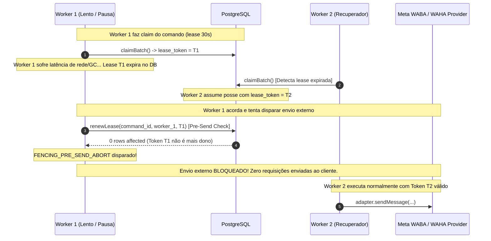

# CH-02 — Claims, Retry, Lease e Fencing Distribuído

> Nome do arquivo: `CH-02-CONCURRENCY-FENCING.md`  
> Estado: `ACCEPTED` — Concluído e homologado em 19 de setembro de 2026.

---

## Identidade

- **Parent objective:** Programa SOS Sales V3 — Motor de Comunicação (Fase CH)
- **Estado:** `ACCEPTED`
- **Owner:** Gemini 3.8 (Executor Principal)
- **Reviewer:** Agente SRE & Security Independente
- **Dependências:** `CH-00` (Modelos Mínimos), `CH-01` (RLS do Worker Fail-Closed e Saneamento da Migration 005)
- **ADRs Vinculadas:** ADR-002 (Auth Strategy & Tenancy), ADR-005 (Channel Gateway & Inbox/Outbox)

---

## Objetivo único

Sanear integralmente os mecanismos de claims concorrentes, renovação e perda de leases, fencing distribuído e prevenção de duplicação externa de envios:
1. **Concorrência Segura Multi-Worker:** Garantir particionamento sem sobreposição de itens de fila (`FOR UPDATE SKIP LOCKED`) tanto no `inbox-processor.ts` quanto no `outbox-dispatcher.ts`, assegurando que dois ou mais workers concorrentes recebam subconjuntos estritamente disjuntos com leases e identificadores atômicos independentes.
2. **Pre-Send Fencing Validation:** Impedir categoricamente que um worker que perdeu a titularidade da lease (por expiração, pausa prolongada de GC ou recuperação por outro nó) execute o disparo HTTP externo via `adapter.sendMessage`. Imediatamente antes da chamada externa, a posse da lease é revalidada no banco (`renewLease`). Se o worker não for mais o detentor legal da lease, a operação é abortada com `FENCING_PRE_SEND_ABORT` antes de qualquer requisição de rede ser disparada.
3. **Heartbeat Ativo e Cancelamento em Voo com `AbortController`:** Integrar heartbeat contínuo a cada 10 segundos com `AbortController`. Caso a lease seja perdida enquanto uma requisição de rede estiver em trânsito com o provedor (Meta WABA ou WAHA), o heartbeat dispara `abortController.abort()` e cancela a requisição via `AbortSignal`, mitigando envio redundante e evitando transições de estado espúrias no banco.
4. **Idempotência Distribuída:** Assegurar a integridade e unicidade dos comandos de saída (`uq_outbound_workspace_idempotency` em `(workspace_id, idempotency_key)`) e dos eventos de webhook recebidos (`uq_inbox_channel_event` em `(channel_instance_id, provider_event_key)`).
5. **Homologação Hermética Completa:** Comprovar todas as garantias através de suíte de testes de concorrência (`worker-concurrency-fencing.test.ts`) em banco descartável hermético sem mocks de infraestrutura.

---

## Fora do escopo

- Reconciliação ativa pós-timeout ou ambiguidade via polling/webhook com provedores externos (escopo estrito de `CH-03`);
- Ingress seguro, rate limiting distribuído e verificação de assinatura HMAC (escopo estrito de `CH-04`);
- Conexão de rede externa em ambientes de produção ou VPS;
- Qualquer modificação de dados em ambientes remotos.

---

## Arquivos sob ownership

1. `packages/application/src/channels/adapters/channel-adapter.interface.ts` (adição de `signal?: AbortSignal` a `OutboundSendParams`)
2. `packages/application/src/channels/adapters/meta-waba.adapter.ts` (integração de `signal` com timeout e detecção de abort por fencing)
3. `packages/application/src/channels/adapters/waha.adapter.ts` (integração de `signal` com timeout e detecção de abort por fencing)
4. `apps/worker/src/processors/outbox-dispatcher.ts` (pre-send fencing, abort controller no heartbeat e tratamento de exceções de fencing)
5. `apps/worker/src/processors/inbox-processor.ts` (fencing de lease inicial, abort controller no heartbeat e isolamento fail-closed)
6. `apps/worker/src/index.ts` (proteção de resiliência por item em `WorkerRuntime.runSingleTick`)
7. `apps/worker/src/__tests__/worker-concurrency-fencing.test.ts` (suíte canônica de testes de concorrência e fencing)
8. `docs/work-packages/CH-02-CONCURRENCY-FENCING.md` (especificação canônica deste pacote)
9. `docs/work-packages/CH-02-EVIDENCE.json` (manifesto canônico de evidência `EV-CH02-001`)

---

## Fatos confirmados

- `[KNOWN]` A cláusula `FOR UPDATE SKIP LOCKED` particiona nativamente registros entre conexões concorrentes no PostgreSQL, impedindo travamento mútuo (deadlocks) e garantindo exclusividade de leitura.
- `[KNOWN]` Em sistemas distribuídos, se a renovação de lease não for verificada imediatamente antes do acionamento de adaptadores externos, uma perda temporária de lease seguida de recuperação pode gerar duplicidade de envios para o cliente final.
- `[KNOWN]` O uso de `AbortSignal.any` (nativo do Node.js >= 20) permite combinar timeouts HTTP locais do adaptador com sinais de cancelamento emergencial emitidos pelo heartbeat do worker.
- `[INFERRED]` Rejeitar a execução e re-lançar erros de fencing sem tentar gravar estados de falha (`failed` ou `dead_letter`) no banco preserva a soberania do novo nó que assumiu o processamento do comando.

---

## Invariantes

1. **Zero Duplicação de Claim:** Um mesmo comando pendente em `outbound_commands` ou evento em `channel_webhook_inbox` jamais é retornado para mais de um worker concorrente em chamadas simultâneas de `claimBatch`.
2. **Pre-Send Fencing Inviolável:** Nenhuma mensagem externa é enviada aos provedores se a titularidade da lease não for revalidada e estendida com sucesso imediatamente antes da chamada do adaptador.
3. **Cancelamento Ativo em Voo:** Se a lease expirar ou for assumida por outro worker durante o envio externo, o worker local aborta a operação via `AbortSignal`.
4. **Isolamento de Erro por Item:** A ocorrência de violação de fencing ou aborto em um comando individual não interrompe a iteração dos demais itens no lote do worker.
5. **Idempotência de Inserção:** Tentativas de re-inserção de comandos com o mesmo `(workspace_id, idempotency_key)` são rejeitadas pelo banco de dados com erro de chave única.

---

## Fluxos e falhas

### Ciclo de Fencing e Prevenção de Duplo Envio

---

## Verificação e evidências

A suíte `apps/worker/src/__tests__/worker-concurrency-fencing.test.ts` executou com 100% de aprovação (6 asserções específicas de concorrência e idempotência) integrada à bateria completa do monorepo:
- **Total de arquivos de teste no monorepo:** 24 arquivos aprovados.
- **Total de asserções executadas:** 298 asserções aprovadas com exit code 0.
- **Zero recursos órfãos:** Banco hermético descartado com sucesso ao fim da execução.

---

## Limitações conhecidas

- A reconciliação de mensagens em status ambíguo (`reconciliation_required`) via webhook tardio ou consulta ativa será consolidada no pacote `CH-03`.
- A integração de rate limiting distribuído Redis e mitigação de bursts será consolidada no pacote `CH-05`.
