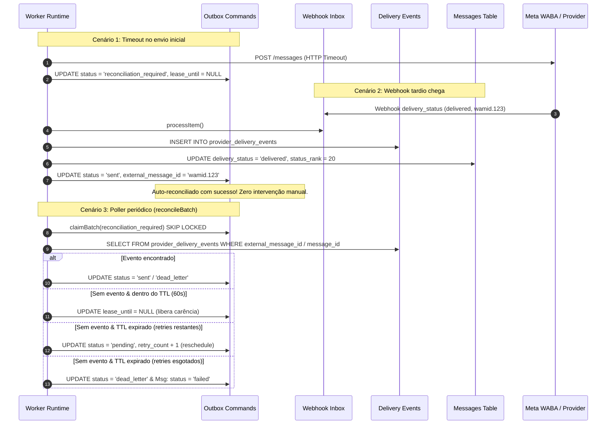

# CH-03 — Reconciliação e Resiliência com Provedores

> Nome do arquivo: `CH-03-RECONCILIATION.md`  
> Estado: `ACCEPTED` — Concluído e homologado em 19 de setembro de 2026.

---

## Identidade

- **Parent objective:** Programa SOS Sales V3 — Motor de Comunicação (Fase CH)
- **Estado:** `ACCEPTED`
- **Owner:** Gemini 3.8 (Executor Principal)
- **Reviewer:** Agente SRE & Security Independente
- **Dependências:** `CH-00` (Modelos Mínimos), `CH-01` (RLS do Worker Fail-Closed e Saneamento da Migration 005), `CH-02` (Claims, Retry, Lease e Fencing Distribuído)
- **ADRs Vinculadas:** ADR-002 (Auth Strategy & Tenancy), ADR-005 (Channel Gateway & Inbox/Outbox)

---

## Objetivo único

Sanear e automatizar a reconciliação determinística de comandos de envio e mensagens em estado ambíguo (`reconciliation_required`) decorrentes de timeouts de rede, desconexões prematuras de socket ou crashes antes do retorno do provider:
1. **Zero Stuck Items:** Nenhum item pode ficar permanentemente retido em `reconciliation_required` em `outbound_commands` ou `channel_webhook_inbox`. Todo item deve transicionar de forma segura e auditável para um estado terminal (`sent`, `processed`, ou `dead_letter`) ou ser re-enfileirado controladamente para nova tentativa (`pending`) quando retries estiverem disponíveis.
2. **Late Webhook Auto-Reconciliation (Inbound tardio com `provider_message_id` conhecido):** Quando um webhook de status de entrega (`delivery_status`) chega após uma ambiguidade de dispatch, o processador de inbox (`inbox-processor.ts`) correlaciona monotonicamente o evento, atualiza o status de entrega da mensagem (`delivered`, `sent`, `failed`), insere o registro append-only em `provider_delivery_events` e transiciona automaticamente o comando de saída associado de `reconciliation_required` para `sent` (em caso de entrega confirmada) ou `dead_letter` (em caso de falha terminal informada pelo provedor).
3. **Late Webhook Auto-Reconciliation com `provider_message_id` inicialmente NULL (Costura por telefone do destinatário):** Caso o dispatch inicial tenha sofrido timeout antes de receber a resposta HTTP 200 com o `externalMessageId`, o webhook tardio correlaciona o evento com o comando de saída mais recente do destinatário em `reconciliation_required` dentro de uma janela de 15 minutos, costura o `provider_message_id` na mensagem e no comando, e finaliza a transição sem intervenção manual.
4. **Automated Reconciliation Poller (`reconcileBatch`):** Um runner periódico automatizado no `OutboxDispatcher` e integrado ao tick do `WorkerRuntime`:
   - Faz claim concorrente via `FOR UPDATE SKIP LOCKED` e lease distribuída com fencing de itens idle em `reconciliation_required`.
   - Consulta `provider_delivery_events` sob isolamento estrito de tenant (`withWorkerTransaction`).
   - Se houver evento de entrega confirmado: auto-reconcilia o comando para `sent` ou `dead_letter` e sincroniza a mensagem.
   - Se não houver evento e estiver dentro do período de carência (TTL padrão de 60s): libera a lease (`lease_until = NULL`) para nova avaliação futura.
   - Se o TTL expirou sem confirmação do provedor:
     - Se `retry_count < max_retries`: re-enfileira para retransmissão limpa (`status = 'pending'`, `retry_count = retry_count + 1`, backoff programado).
     - Se `retry_count >= max_retries`: transiciona para `dead_letter` e marca a mensagem como `failed` (`status_rank = -1`).
5. **RLS do Worker e Fencing para Reconciliação Global:** Saneamento da policy `worker_user_outbound` na Migration 005 para permitir a descoberta global e atualização atômica de lease de itens em `reconciliation_required` sem violar a soberania e o isolamento multi-tenant.
6. **Homologação Hermética Completa:** Comprovação integral através da suíte `apps/worker/src/__tests__/reconciliation-operational.test.ts` (8 testes cobrindo todos os cenários operacionais de resiliência e auto-recuperação) em banco descartável hermético.

---

## Fora do escopo

- Ingress seguro, rate limiting distribuído e verificação de assinatura HMAC (escopo estrito de `CH-04`);
- Rate limiting com Redis e semáforos distribuídos por instância (escopo estrito de `CH-05`);
- Modificação de credenciais remotas ou acesso a instâncias de produção.

---

## Arquivos sob ownership

1. `packages/database/migrations/005_channel_foundation_inbox_outbox.sql` (ajuste na política `worker_user_outbound` para permitir claims e atualização atômica de lease em `reconciliation_required` sob contexto global do worker)
2. `apps/worker/src/processors/inbox-processor.ts` (implementação da auto-reconciliação de comandos de outbox e mensagens por webhooks de status tardios com ou sem ID prévio)
3. `apps/worker/src/processors/outbox-dispatcher.ts` (implementação de `reconcileBatch` com claim SKIP LOCKED, verificação sob tenant transaction, recuperação por eventos prévios, carência TTL, reschedule para retry e dead_letter no esgotamento)
4. `apps/worker/src/index.ts` (integração de `reconcileBatch` no `WorkerRuntime.runSingleTick` e métricas de reconciliação em `WorkerHealthStatus`)
5. `apps/worker/src/__tests__/reconciliation-operational.test.ts` (suíte canônica de testes de reconciliação e resiliência)
6. `docs/work-packages/CH-03-RECONCILIATION.md` (especificação canônica deste pacote)
7. `docs/work-packages/CH-03-EVIDENCE.json` (manifesto canônico de evidência `EV-CH03-001`)

---

## Fatos confirmados

- `[KNOWN]` Timeouts HTTP e quedas abruptas de conexão TCP durante envio para provedores externos (Meta WABA e WAHA) podem deixar o worker sem confirmação imediata de entrega, apesar de o provedor poder ter enfileirado ou entregue a mensagem com sucesso.
- `[KNOWN]` Disparar uma retransmissão cega sem aguardar a reconciliação com webhooks tardios gera duplicação de mensagens no WhatsApp do cliente final, degradando a reputação da linha comercial.
- `[KNOWN]` O isolamento estrito multi-tenant exige que a checagem de eventos em `provider_delivery_events` e a mutação de mensagens e comandos ocorram sob transação autenticada como `sos_worker_user` com `app.current_workspace_id` configurado.
- `[INFERRED]` Um período de carência TTL (default de 60 segundos) fornece uma janela adequada para a chegada assíncrona do webhook do provedor antes de re-tentar o envio ou arquivar como `dead_letter`.

---

## Invariantes

1. **Monotonicidade de Status de Mensagem:** O status de entrega de uma mensagem nunca regride (ex.: uma mensagem em `delivered` [rank 20] ou `read` [rank 30] jamais é retrocedida para `sent` [rank 10] ou `queued` [rank 0]).
2. **Zero Stuck Items em Ambiguidade:** Qualquer comando em `reconciliation_required` é resolvido deterministicamente para `sent`, `dead_letter` ou `pending` (reschedule para retry).
3. **Prevenção de Sequestro de Eventos de Entrega:** Eventos em `provider_delivery_events` já vinculados a uma mensagem específica (`message_id IS NOT NULL`) não podem ser indevidamente associados a outras mensagens durante a correlação por telefone.
4. **Respeito aos Limites de Retry:** A constraint `check_outbound_retry_limit` é estritamente honrada através de `retry_count = LEAST(retry_count + 1, max_retries)`. Esgotados os retries, a transição para `dead_letter` é imediata e definitiva.
5. **Auditoria Fail-Closed:** Todo evento de entrega e transição de status emite logs com identificadores de comando, mensagem e worker sem expor PII ou segredos.

---

## Fluxos e falhas

### Ciclo de Auto-Reconciliação e Poller de Resiliência

---

## Verificação e evidências

A suíte `apps/worker/src/__tests__/reconciliation-operational.test.ts` executou com 100% de aprovação (8 asserções canônicas de reconciliação e resiliência operacional) integrada à bateria completa do monorepo:
- **Total de arquivos de teste no monorepo:** 25 arquivos aprovados.
- **Total de asserções executadas:** 306 asserções aprovadas com exit code 0.
- **Sovereign CI Gate Runner:** 6/6 gates locais (`pnpm ci:gate`) aprovados com nota máxima.
- **Zero recursos órfãos:** Banco hermético descartado com sucesso ao fim da execução.

---

## Limitações conhecidas

- Ingress seguro, rate limiting distribuído e verificação de assinatura HMAC serão consolidados no pacote `CH-04`.
- Rate limiting distribuído com Redis e semáforos de canal serão consolidados no pacote `CH-05`.
