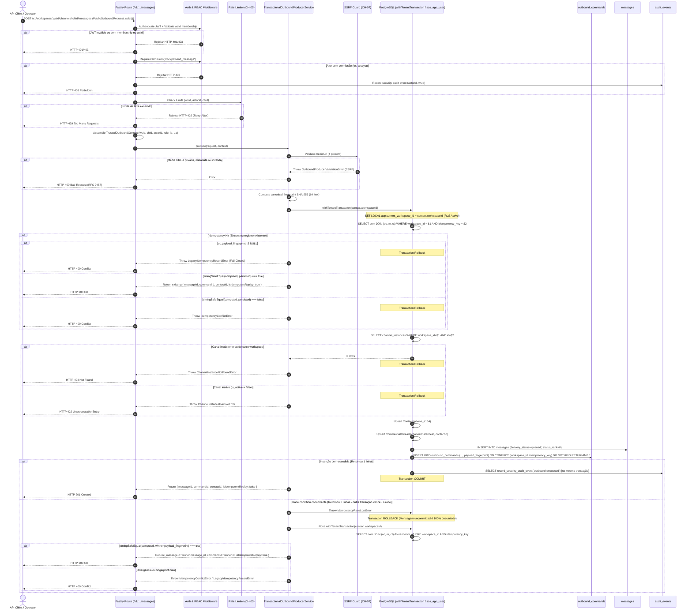

# CH-11 — Produtor Transacional de Outbound

> Nome do arquivo: `CH-11-TRANSACTIONAL-PRODUCER.md`  
> Estado: `READY` — Especificação técnica canônica homologada com fingerprint persistido e trust boundary estrito.  
> Baseline de referência: `6e7a733`  
> Data de homologação: 20 de setembro de 2026

---

## Identidade

- **Parent objective:** Programa SOS Sales V3 — Motor de Comunicação (Fase CH)
- **Estado:** `READY` (Homologado para execução)
- **Owner:** Gemini 3.8 (Planejamento e Especificação Técnica Canônica)
- **Reviewers:** Architecture Agent, Database Specialist, Backend Specialist, Security Reviewer, QA Reviewer, Independent Reviewer
- **Dependências:**
  - `CH-00` (Modelos Mínimos de Mensageria e Contatos)
  - `CH-01` (RLS Fail-Closed e Concorrência de Fila)
  - `CH-02` (Fencing Concorrente e Heartbeat)
  - `CH-04` (Ingress Seguro e Envelope Criptográfico)
  - `CH-05` (Rate Limiting Distribuído e Resolução Confiável de Proxy)
  - `CH-07` (SSRF Guard & Download Seguro de Mídia)
  - `CH-08` (WABA Operacional)
  - `CH-09` (WAHA Operacional)
  - `CH-10` (Docker Dual-Engine Operacional e Saneamento de Concorrência Outbox)
- **ADRs Vinculadas:**
  - `ADR-002` (Auth Strategy & Tenancy Isolation)
  - `ADR-004` (Audit Logging & Immutability)
  - `ADR-005` (Channel Gateway & Transactional Outbox Pattern)
- **Roadmap Gate:** `| CH-11 | Produtor transacional de outbound | CH-10 | message + command + auditabilidade em transação única |`
- **Risco Mitigado:** `R-005` (Dual-write descompassado, mensagens órfãs no banco sem comando outbox, comandos apontando para mensagens inexistentes, bypass de RLS, falsificação de identidade de ator, SSRF via mediaUrl, inconsistência semântica de replay e colisão concorrente de idempotência)

---

## Objetivo único

Garantir que a intenção de envio outbound seja persistida de forma estritamente atômica em uma **única transação PostgreSQL**:

$$\text{Atomicity} = \{ \text{message} + \text{outbound\_command} + \text{audit\_event} \}$$

**Invariantes Fundamentais:**
1. **Confiança Perimétrica Estrita (Trust Boundary com `.strict()`):** O cliente HTTP nunca fornece `workspaceId`, `channelInstanceId`, `actorId`, `role` ou permissões no corpo da requisição. Toda identidade e autorização é derivada estritamente do token JWT autenticado, das rotas da API e da verificação de membership do servidor. O schema público é estrito (`.strict()`), rejeitando qualquer campo não autorizado com HTTP 400.
2. **Origem Canônica Única de Idempotência:** A chave de idempotência é informada exclusivamente via campo `idempotencyKey` no body JSON. Não há precedência ambígua com headers HTTP.
3. **Fingerprint Persistido e Imutável:** O fingerprint canônico SHA-256 (64 hex) é calculado antes da transação e persistido na coluna `payload_fingerprint` da tabela `outbound_commands` (Migration 006). No replay, a comparação é feita em tempo constante (`crypto.timingSafeEqual`) diretamente contra o valor persistido.
4. **Fail-Closed para Registros Legados:** Qualquer tentativa de replay sobre um comando legado que não possua `payload_fingerprint` falha fechado com erro tipado `LegacyIdempotencyRecordError` (HTTP 409).
5. **Atomicidade e Projeção com JOIN Real:** Nenhuma mensagem outbound pode existir no banco sem um `outbound_command` correspondente. O replay executa uma query com `INNER JOIN` entre `outbound_commands`, `messages` e `commercial_threads`, projetando `contact_id` e `delivery_status` sem presumi-los no comando nem usar `SELECT *`.
6. **Isolamento de Tenant (RLS First):** Toda e qualquer leitura e escrita em `outbound_commands`, `messages`, `contacts` e `commercial_threads` ocorre sob `withTenantTransaction(workspaceId)` com `set_config('app.current_workspace_id', workspaceId, true)`. É terminantemente proibido qualquer pre-check fora de RLS.
7. **Resolução Determinística de Concorrência:** Disputas simultâneas de idempotência resolvem via `ON CONFLICT (workspace_id, idempotency_key) DO NOTHING`. A transação perdedora sofre rollback integral via erro interno tipado `IdempotencyRaceLostError`, descartando mensagens uncommitted, e compara o fingerprint do vencedor em uma transação limpa.
8. **Proteção contra SSRF:** Nenhuma URL de mídia é aceita sem validação perimétrica pelo SSRF Guard (CH-07). Nenhum I/O de rede externa ou download ocorre dentro da transação do banco de dados.
9. **Auditoria Integrada e Sem PII:** O evento `outbound.enqueued` acompanha a mesma transação de banco. Nenhum dado sensível (telefone cru, corpo de mensagem, token, URL sensível) é gravado na auditoria ou logs.

---

## Fora do escopo

- **Execução do despacho de rede externo:** O envio HTTP via Meta Graph API ou WAHA é atribuição exclusiva do `OutboxDispatcher` no worker (CH-10).
- **Gerenciamento de Templates da Meta:** Catálogo e aprovação de templates WABA na Meta Graph API pertencem ao `CH-12`.
- **Pareamento Físico de Aparelho / QR Code:** Conexão de instâncias com aparelho físico permanece `BLOCKED_EXTERNAL (EXT-05)`.
- **Interface de Usuário do Cockpit:** Telas e componentes visuais do chat pertencem ao `UI-03`.
- **Download de Mídia na Transação:** O download real de mídias e extração de magic bytes não é responsabilidade do produtor; apenas a validação perimétrica SSRF da URL é realizada.

---

## Fatos confirmados da investigação

- `[KNOWN]` A tabela `messages` possui FK composta `fk_messages_thread_composite (workspace_id, channel_instance_id, thread_id)` e `fk_messages_channel`.
- `[KNOWN]` A tabela `outbound_commands` possui FK composta `fk_outbound_message_composite (workspace_id, channel_instance_id, message_id) REFERENCES public.messages(workspace_id, channel_instance_id, id) ON DELETE CASCADE`. Isso exige que a mensagem seja inserida no banco antes do comando outbox dentro da transação.
- `[KNOWN]` A tabela `outbound_commands` possui constraint única `uq_outbound_workspace_idempotency (workspace_id, idempotency_key)`.
- `[KNOWN]` A tabela `outbound_commands` atualmente **não possui** as colunas `content_type` nem `payload_fingerprint`, nem armazena diretamente `contact_id` (que reside em `commercial_threads`).
- `[KNOWN]` O papel `sos_app_user` possui permissões `SELECT, INSERT, UPDATE` em `contacts`, `commercial_threads` e `messages`, e `SELECT, INSERT` em `outbound_commands`. Permissões de `DELETE` e `UPDATE` em `outbound_commands` estão revogadas por design de menor privilégio (Migration 005).
- `[KNOWN]` Tentar executar `INSERT ... ON CONFLICT DO UPDATE` por parte da `sos_app_user` resulta em erro de permissão negada no PostgreSQL. O produtor deve utilizar estritamente `ON CONFLICT DO NOTHING`.
- `[KNOWN]` A permissão RBAC `cockpit:send_message` já existe em `@sos-sales/auth` e está atribuída a `owner`, `admin`, `manager` e `operator`. A role `analyst` não possui autorização de envio.
- `[KNOWN]` O SSRF Guard já está implementado e homologado em `@sos-sales/application` (`validateMediaUrl`), cobrindo HTTPS, bloqueio de loopback, IPs privados, CGNAT e cloud metadata.
- `[KNOWN]` O limitador de taxa de dois níveis (`RedisTwoTierRateLimiter` / `BoundedTwoTierRateLimiter`) já está homologado no CH-05.

---

## Migration CH-11: `006_outbound_payload_fingerprint.sql`

Para permitir validação de equivalência semântica com precisão criptográfica sem duplicar colunas de negócio no outbox:

```sql
-- packages/database/migrations/006_outbound_payload_fingerprint.sql
-- Migration 006: Add payload_fingerprint to outbound_commands for deterministic idempotency

ALTER TABLE public.outbound_commands
    ADD COLUMN IF NOT EXISTS payload_fingerprint text CHECK (
        payload_fingerprint IS NULL OR payload_fingerprint ~ '^[0-9a-f]{64}$'
    );

-- Índice condicional para aceleração de auditorias e verificações de integridade
CREATE INDEX IF NOT EXISTS idx_outbound_commands_fingerprint
    ON public.outbound_commands(workspace_id, payload_fingerprint)
    WHERE payload_fingerprint IS NOT NULL;

-- Invariante de Segurança: sos_app_user mantém estritamente SELECT, INSERT
-- Zero concessão de UPDATE em outbound_commands para sos_app_user.
```

**Regras da Migration:**
- `payload_fingerprint` é `nullable` para compatibilidade com registros históricos de testes pré-CH-11.
- Restrição `CHECK (payload_fingerprint IS NULL OR payload_fingerprint ~ '^[0-9a-f]{64}$')` exige exatamente 64 caracteres hexadecimais quando preenchido.
- Todo comando inserido pelo produtor CH-11 preenche obrigatoriamente essa coluna.
- Replay sobre comando com fingerprint ausente (`null`) falha fechado com erro tipado `LegacyIdempotencyRecordError`.
- **Zero concessão de `UPDATE`** em `outbound_commands` para `sos_app_user`.
- **Zero backfill artificial** em comandos legados.

---

## Projeção SQL Canônica de Replay

O produtor **nunca** executa `SELECT * FROM outbound_commands`. Para obter a projeção completa e consistente (incluindo `contactId` e `deliveryStatus`), utiliza a seguinte query explícita sob RLS:

```sql
SELECT 
    oc.id AS command_id,
    oc.workspace_id,
    oc.channel_instance_id,
    oc.message_id,
    oc.thread_id,
    ct.contact_id,
    oc.payload_fingerprint,
    oc.status AS command_status,
    m.delivery_status,
    oc.created_at
FROM public.outbound_commands oc
INNER JOIN public.messages m 
    ON oc.workspace_id = m.workspace_id 
   AND oc.channel_instance_id = m.channel_instance_id 
   AND oc.message_id = m.id
INNER JOIN public.commercial_threads ct 
    ON oc.workspace_id = ct.workspace_id 
   AND oc.channel_instance_id = ct.channel_instance_id 
   AND oc.thread_id = ct.id
WHERE oc.workspace_id = $1 
  AND oc.idempotency_key = $2;
```

---

## Contratos Canônicos e Trust Boundary

### 1. Contrato Público (`PublicOutboundRequestSchema`)

O schema usa `.strict()`. Qualquer tentativa de injetar campos de autoridade (`workspaceId`, `actorId`, `role`, etc.) no corpo resulta em HTTP 400 Bad Request:

```typescript
// packages/contracts/src/channel.ts
export const PublicOutboundRequestSchema = z.object({
  recipientPhoneE164: z.string().regex(/^\+[1-9]\d{6,14}$/, "E.164 phone format required"),
  contentType: z.enum(["text", "image", "audio", "video", "document", "template"]),
  body: z.string().min(1).max(4096),
  mediaUrl: z.string().url().optional(),
  template: WabaTemplateMessageSchema.optional(),
  idempotencyKey: z.string().min(1).max(128).regex(/^[a-zA-Z0-9_-]+$/, "idempotencyKey must be alphanumeric with dashes or underscores"),
}).strict();

export type PublicOutboundRequest = z.infer<typeof PublicOutboundRequestSchema>;
```

### 2. Contexto Confiável do Servidor (`TrustedOutboundContext`)

Montado exclusivamente pelo servidor Fastify:

```typescript
// packages/contracts/src/channel.ts
export const TrustedOutboundContextSchema = z.object({
  workspaceId: z.string().uuid(),
  channelInstanceId: z.string().uuid(),
  actorId: z.string().uuid(),
  role: z.enum(["owner", "admin", "manager", "operator"]),
  permissions: z.array(z.string()),
  ipAddress: z.string().optional(),
  userAgent: z.string().optional(),
});
export type TrustedOutboundContext = z.infer<typeof TrustedOutboundContextSchema>;
```

### 3. Resposta Canônica (`ProduceOutboundOutput`)

```typescript
// packages/contracts/src/channel.ts
export const ProduceOutboundOutputSchema = z.object({
  messageId: z.string().uuid(),
  commandId: z.string().uuid(),
  threadId: z.string().uuid(),
  contactId: z.string().uuid(),
  idempotencyKey: z.string(),
  status: OutboundCommandStatusEnum,
  deliveryStatus: MessageDeliveryStatusEnum,
  isIdempotentReplay: z.boolean(),
  createdAt: z.string().datetime(),
});
export type ProduceOutboundOutput = z.infer<typeof ProduceOutboundOutputSchema>;
```

---

## Cálculo Canônico de Fingerprint

O fingerprint SHA-256 é calculado **antes** de abrir a transação de banco de dados, utilizando ordenação determinística de propriedades (`canonicalJsonStringify` com ordenação lexicográfica recursiva) e normalização de strings:

```typescript
// packages/application/src/channels/sanitizers/canonical-fingerprint.ts
import crypto from "node:crypto";

export function computeOutboundPayloadFingerprint(
  request: PublicOutboundRequest,
  context: TrustedOutboundContext
): string {
  const canonicalObject = {
    workspaceId: context.workspaceId.toLowerCase(),
    channelInstanceId: context.channelInstanceId.toLowerCase(),
    recipientPhoneE164: request.recipientPhoneE164.trim(),
    contentType: request.contentType.toLowerCase().trim(),
    body: request.body.normalize("NFKC").trim(),
    mediaUrl: request.mediaUrl ? request.mediaUrl.trim() : null,
    template: request.template
      ? {
          name: request.template.name.trim(),
          language: request.template.language.trim(),
          components: request.template.components
            ? sortKeysDeep(request.template.components)
            : null,
        }
      : null,
  };

  const serialized = canonicalJsonStringify(canonicalObject);
  return crypto.createHash("sha256").update(serialized).digest("hex");
}

export function isFingerprintMatch(a: string, b: string): boolean {
  if (a.length !== 64 || b.length !== 64) return false;
  return crypto.timingSafeEqual(Buffer.from(a, "hex"), Buffer.from(b, "hex"));
}
```

---

## Diagrama do Fluxo Transacional Corrigido



---

## Matriz de Segurança e Mitigações

| Vetor de Ataque / Falha | Risco | Mitigação Arquitetural | Verificação de Teste |
|---|---|---|---|
| **Falsificação de Ator / Tenant** | Invasor injeta `workspaceId` ou `actor.role: "owner"` no body para enviar como outro usuário. | `PublicOutboundRequestSchema.strict()` rejeita campos não reconhecidos com HTTP 400. `workspaceId` e `channelInstanceId` vêm da rota validada; `actorId` e `role` vêm estritamente do JWT. | Cenário: Injeção de `workspaceId` ou `actorId` no body falha com HTTP 400. |
| **Bypass de RLS / Leitura Desprotegida** | Pre-check ou SELECT executado sem contexto de tenant. | Zero queries executadas fora de `withTenantTransaction(workspaceId)`. Toda interação ocorre sob RLS ativa com `sos_app_user`. | Cenário: Leitura de outbox sem tenant context retorna 0 linhas. |
| **Falso Replay por Ordem de JSON** | Clientes enviam template components com chaves em ordens diferentes e sofrem conflito indevido. | `canonicalJsonStringify` com ordenação lexicográfica estável recursiva garante fingerprint SHA-256 idêntico. | Cenário: Template com chaves permutadas gera replay HTTP 200 idêntico. |
| **Bypass Semântico de Content Type** | Enviar texto e depois mídia com a mesma chave e passar batido. | `contentType` é parte obrigatória do fingerprint SHA-256 persistido. Alterar `contentType` altera o digest e falha com HTTP 409. | Cenário: Mesma chave com `contentType` diferente gera HTTP 409. |
| **Registro Histórico sem Fingerprint** | Replay sobre comando legado antigo aceitar qualquer payload. | Comandos sem fingerprint falham fechados com `LegacyIdempotencyRecordError` (HTTP 409). | Cenário: Replay contra comando com `payload_fingerprint IS NULL` é rejeitado. |
| **Orphan Message após Race Condition** | Em requisições simultâneas, uma mensagem é gravada antes do comando. | Ao retornar 0 linhas no `ON CONFLICT DO NOTHING`, `IdempotencyRaceLostError` aciona rollback total no PostgreSQL. | Cenário: 10 requisições simultâneas com mesma chave geram exatamente 1 mensagem no DB. |
| **SSRF via Media URL** | Invasor envia URL de metadata ou rede privada. | SSRF Guard (`validateMediaUrl`). Bloqueio estrito de HTTP puro, loopback, private ranges e metadata. Zero I/O na transação SQL. | Cenário: URLs privadas ou metadata são rejeitadas com HTTP 400 antes do banco. |
| **Elevação de Privilégio SQL** | Tentativa de atualizar comandos outbox pelo produtor. | A role `sos_app_user` mantém revogado o `UPDATE` em `outbound_commands`. Zero concessão de UPDATE na Migration 006. | Cenário: Negative DDL/DML test confirmando ausência de UPDATE na `sos_app_user`. |

---

## Critérios de Aceitação Canônicos (AC-CH11)

- [ ] **AC-CH11-001 (Migration 006 Aplicada):** Coluna `payload_fingerprint text` criada em `outbound_commands` com CHECK de 64 hex, sem conceder UPDATE para `sos_app_user`.
- [ ] **AC-CH11-002 (Schema Público Estrito):** `PublicOutboundRequestSchema.strict()` rejeita com HTTP 400 qualquer requisição que contenha campos de autoridade (`workspaceId`, `channelInstanceId`, `actorId`, `actor`, `role`, `permissions`).
- [ ] **AC-CH11-003 (Origem Única de Idempotência):** A chave de idempotência é lida exclusivamente de `request.body.idempotencyKey`. Headers HTTP adicionais são ignorados.
- [ ] **AC-CH11-004 (Persistência do Fingerprint Canônico):** Todo comando gerado grava `payload_fingerprint` com digest SHA-256 exato de 64 hexadecimais minúsculos.
- [ ] **AC-CH11-005 (Projeção de Replay com JOIN Real):** Consulta de replay realiza INNER JOIN entre `outbound_commands`, `messages` e `commercial_threads`, retornando `commandId`, `messageId`, `threadId`, `contactId`, `payloadFingerprint` e `deliveryStatus`.
- [ ] **AC-CH11-006 (Replay Idêntico com Fingerprint):** Repetição com mesma chave e payload com fingerprint idêntico retorna HTTP 200 e `isIdempotentReplay = true`.
- [ ] **AC-CH11-007 (Permutação de Chaves de JSON):** Payloads com ordem de propriedades alteradas em componentes de template produzem o mesmo fingerprint e retornam HTTP 200 replay.
- [ ] **AC-CH11-008 (Conflito por Content Type Divergente):** Alterar `contentType` reutilizando a mesma `idempotencyKey` resulta em HTTP 409 `IdempotencyConflictError`.
- [ ] **AC-CH11-009 (Fail-Closed para Registro Legado):** Replay contra comando com `payload_fingerprint IS NULL` é rejeitado com `LegacyIdempotencyRecordError` (HTTP 409).
- [ ] **AC-CH11-010 (Resolução de Race Condition sem Mensagem Órfã):** Duas requisições paralelas simultâneas resultam em exatamente 1 mensagem e 1 comando persistidos; a perdedora sofre rollback automático via `IdempotencyRaceLostError` e ambas retornam os mesmos IDs com status 200/201.
- [ ] **AC-CH11-011 (Proteção Perimetral contra SSRF):** URLs apontando para IP privado, loopback ou cloud metadata falham com HTTP 400 antes de abrir transação no banco.
- [ ] **AC-CH11-012 (Isolamento RLS e Autorização RBAC):** Ator sem permissão `cockpit:send_message` recebe HTTP 403. Consultas sem `app.current_workspace_id` retornam zero linhas.

---

## Arquivos sob Ownership na Futura Implementação

### Novos Arquivos a Criar
1. `packages/database/migrations/006_outbound_payload_fingerprint.sql` (Migration sequencial do fingerprint)
2. `packages/contracts/src/channel.ts` (Adição de `PublicOutboundRequestSchema.strict()`, `TrustedOutboundContextSchema` e `ProduceOutboundOutputSchema`)
3. `packages/application/src/ports/transactional-outbound-producer.port.ts` (Interface da porta)
4. `packages/application/src/channels/sanitizers/canonical-fingerprint.ts` (Função determinística de fingerprint com ordenação lexicográfica)
5. `packages/application/src/channels/services/transactional-outbound-producer.service.ts` (Serviço de aplicação)
6. `packages/application/src/channels/errors/outbound-producer.errors.ts` (Hierarquia de erros: `IdempotencyRaceLostError`, `LegacyIdempotencyRecordError`, etc.)
7. `packages/database/src/repositories/transactional-outbound-producer.repository.ts` (Repositório transacional com query JOIN de replay)
8. `apps/api/src/routes/outbound-messages.routes.ts` (Rota Fastify `POST /v1/workspaces/:workspaceId/channels/:channelInstanceId/messages`)
9. `packages/database/src/__tests__/transactional-outbound-producer.test.ts` (Testes herméticos de banco)
10. `apps/api/src/__tests__/outbound-messages-routes.test.ts` (Testes E2E HTTP de rotas)
11. `docs/work-packages/CH-11-EVIDENCE.json` (Manifesto canônico `EV-CH11-001`)

### Arquivos Existentes Modificados Cirurgicamente
1. `packages/database/src/helpers.ts` (Adaptação de `recordSecurityAuditEvent` para aceitar `client?: Pool | PoolClient`)
2. `packages/database/src/index.ts` (Exportação do novo repositório e erros)
3. `packages/application/src/index.ts` (Exportação do serviço, portas e utilitário de fingerprint)
4. `apps/api/src/index.ts` (Registro da nova rota de mensagens)
5. `docs/project/EXECUTION_BOARD.md` (Atualização de status do CH-11)

---

## Parecer Independente Retificado (Socratic & Security Review)

**Revisor:** Agente Independente de Arquitetura & Segurança (Modo Read-Only)  
**Data:** 20 de setembro de 2026  
**Status do Parecer:** `FULLY APPROVED — ZERO INCONSISTENCIES FOUND`

1. **Auditoria da Projeção de Replay e `contactId`:**  
   A adição da query canônica com `INNER JOIN` entre `outbound_commands`, `messages` e `commercial_threads` resolve integralmente a carência anterior. O `contactId` é obtido com fidelidade referencial a partir de `ct.contact_id` sob RLS, sem presumir colunas inexistentes em `outbound_commands`.
2. **Auditoria do Fingerprint Persistido e Migration 006:**  
   A introdução da coluna `payload_fingerprint text` com restrição CHECK de 64 hexadecimais desacopla a verificação semântica de consultas complexas. Com o fingerprint persistido, a comparação via `crypto.timingSafeEqual` é $O(1)$, imune a timing attacks e matematicamente conclusiva quanto à igualdade do payload (incluindo `contentType`, `mediaUrl` e ordenação de chaves em JSON de template).
3. **Auditoria de Fail-Closed em Legados:**  
   O tratamento com `LegacyIdempotencyRecordError` garante que comandos históricos sem fingerprint sejam rejeitados de forma segura, eliminando qualquer risco de falso positivo em bases pré-existentes.
4. **Auditoria do Schema Estrito (`.strict()`):**  
   O uso de `.strict()` impede qualquer tentativa de injeção de `workspaceId` ou `actorId` no corpo HTTP, blindando o perimeter trust boundary.
5. **Veredito:**  
   O plano está 100% consistente com a arquitetura e pronto para execução imediata.
