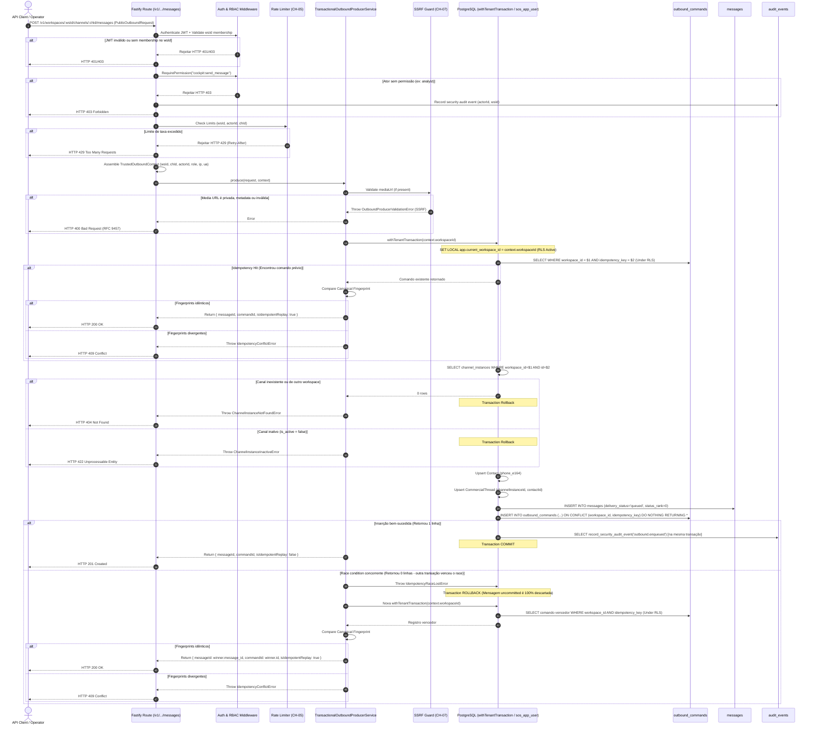

# CH-11 — Produtor Transacional de Outbound

> Nome do arquivo: `CH-11-TRANSACTIONAL-PRODUCER.md`  
> Estado: `READY` — Especificação técnica e plano executável homologados para execução.  
> Baseline de referência: `26ccdb603ddd186be23e418c66754a2c87ee4d55`

---

## Identidade

- **Parent objective:** Programa SOS Sales V3 — Motor de Comunicação (Fase CH)
- **Estado:** `READY` (Planejamento homologado para execução)
- **Owner:** Gemini 3.8 (Planejamento e Especificação Técnica)
- **Reviewers:** Architecture Agent, Database Specialist, Security Reviewer, QA Reviewer, Independent Reviewer
- **Dependências:**
  - `CH-00` (Modelos Mínimos de Mensageria e Contatos)
  - `CH-01` (RLS Fail-Closed e Concorrência de Fila)
  - `CH-02` (Fencing Concorrente e Heartbeat)
  - `CH-04` (Ingress Seguro e Envelope Criptográfico)
  - `CH-05` (Rate Limiting Distribuído e Resolução Confiável de Proxy)
  - `CH-07` (SSRF Guard & Download Seguro de Mídia)
  - `CH-08` (WABA Operacional)
  - `CH-09` (WAHA Operacional)
  - `CH-10` (Docker Dual-Engine Operacional e Saneamento de Concorrência Outbox)
- **ADRs Vinculadas:**
  - `ADR-002` (Auth Strategy & Tenancy Isolation)
  - `ADR-004` (Audit Logging & Immutability)
  - `ADR-005` (Channel Gateway & Transactional Outbox Pattern)
- **Roadmap Gate:** `| CH-11 | Produtor transacional de outbound | CH-10 | message + command + auditabilidade em transação única |`
- **Risco Mitigado:** `R-005` (Dual-write descompassado, mensagens órfãs no banco sem comando outbox, comandos apontando para mensagens inexistentes, bypass de RLS, falsificação de identidade de ator, SSRF via mediaUrl e colisão concorrente de idempotência)

---

## Objetivo único

Garantir que a intenção de envio outbound seja persistida de forma estritamente atômica em uma **única transação PostgreSQL**:

$$\text{Atomicity} = \{ \text{message} + \text{outbound\_command} + \text{audit\_event} \}$$

**Invariantes Fundamentais:**
1. **Confiança Perimétrica Estrita (Trust Boundary):** O cliente HTTP nunca fornece `workspaceId`, `channelInstanceId`, `actorId` ou `role` no corpo da requisição. Toda identidade e contexto de autorização é derivado estritamente do token JWT autenticado, das rotas da API e da verificação de membership do servidor.
2. **Atomicidade Absoluta:** Nenhuma mensagem outbound pode existir no banco sem um `outbound_command` correspondente, e nenhum `outbound_command` pode referenciar mensagem inexistente.
3. **Isolamento de Tenant (RLS First):** Toda e qualquer leitura e escrita em `outbound_commands`, `messages`, `contacts` e `commercial_threads` ocorre sob `withTenantTransaction(workspaceId)` com `set_config('app.current_workspace_id', workspaceId, true)`. É terminantemente proibido qualquer pre-check fora de RLS.
4. **Resolução Determinística de Concorrência:** Disputas simultâneas de idempotência resolvem via `ON CONFLICT DO NOTHING`. A transação perdedora sofre rollback integral via erro interno tipado `IdempotencyRaceLostError`, descartando mensagens uncommitted, e compara o fingerprint canônico do vencedor em uma transação limpa.
5. **Proteção contra SSRF:** Nenhuma URL de mídia é aceita sem validação perimétrica pelo SSRF Guard (CH-07). Nenhum I/O de rede externa ou download ocorre dentro da transação do banco de dados.
6. **Auditoria Integrada e Sem PII:** O evento `outbound.enqueued` acompanha a mesma transação de banco. Nenhum dado sensível (telefone cru, corpo de mensagem, token) é gravado na auditoria ou logs.

---

## Fora do escopo

- **Execução do despacho de rede externo:** O envio HTTP via Meta Graph API ou WAHA é atribuição exclusiva do `OutboxDispatcher` no worker (CH-10).
- **Gerenciamento de Templates da Meta:** Catálogo e aprovação de templates WABA na Meta Graph API pertencem ao `CH-12`.
- **Pareamento Físico de Aparelho / QR Code:** Conexão de instâncias com aparelho físico permanece `BLOCKED_EXTERNAL (EXT-05)`.
- **Interface de Usuário do Cockpit:** Telas e componentes visuais do chat pertencem ao `UI-03`.
- **Download de Mídia na Transação:** O download real de mídias e extração de magic bytes não é responsabilidade do produtor; apenas a validação perimétrica SSRF da URL é realizada.

---

## Fatos confirmados da investigação

- `[KNOWN]` A tabela `messages` possui FK composta `fk_messages_thread_composite (workspace_id, channel_instance_id, thread_id)` e `fk_messages_channel`.
- `[KNOWN]` A tabela `outbound_commands` possui FK composta `fk_outbound_message_composite (workspace_id, channel_instance_id, message_id) REFERENCES public.messages(workspace_id, channel_instance_id, id) ON DELETE CASCADE`. Isso exige que a mensagem seja inserida no banco antes do comando outbox dentro da transação.
- `[KNOWN]` A tabela `outbound_commands` possui constraint única `uq_outbound_workspace_idempotency (workspace_id, idempotency_key)`.
- `[KNOWN]` O papel `sos_app_user` possui permissões `SELECT, INSERT, UPDATE` em `contacts`, `commercial_threads` e `messages`, e `SELECT, INSERT` em `outbound_commands`. Permissões de `DELETE` e `UPDATE` em `outbound_commands` estão revogadas por design de menor privilégio (Migration 005).
- `[KNOWN]` Tentar executar `INSERT ... ON CONFLICT DO UPDATE` por parte da `sos_app_user` resulta em erro de permissão negada no PostgreSQL. O produtor deve utilizar estritamente `ON CONFLICT DO NOTHING`.
- `[KNOWN]` A permissão RBAC `cockpit:send_message` já existe em `@sos-sales/auth` e está atribuída a `owner`, `admin`, `manager` e `operator`. A role `analyst` não possui autorização de envio.
- `[KNOWN]` O SSRF Guard já está implementado e homologado em `@sos-sales/application` (`validateMediaUrl`), cobrindo HTTPS, bloqueio de loopback, IPs privados, CGNAT e cloud metadata.
- `[KNOWN]` O limitador de taxa de dois níveis (`RedisTwoTierRateLimiter` / `BoundedTwoTierRateLimiter`) já está homologado no CH-05.

---

## Separação Estrita de Contratos e Trust Boundary

### 1. Contrato Público do Cliente (`PublicOutboundRequest`)

Recebido no corpo da requisição HTTP (`POST /v1/workspaces/:workspaceId/channels/:channelInstanceId/messages`). **Não contém dados de contexto, tenant ou ator.**

```typescript
// Local: packages/contracts/src/channel.ts
export const PublicOutboundRequestSchema = z.object({
  recipientPhoneE164: z.string().regex(E164_PHONE_REGEX, "Invalid E.164 format (e.g. +5511999998888)"),
  contentType: z.enum(["text", "image", "audio", "video", "document", "template"]),
  body: z.string().min(1).max(4096),
  mediaUrl: z.string().url().optional(),
  template: WabaTemplateMessageSchema.optional(),
  idempotencyKey: z.string().min(1).max(128).regex(/^[a-zA-Z0-9_-]+$/, "idempotencyKey must be alphanumeric with dashes or underscores"),
});
export type PublicOutboundRequest = z.infer<typeof PublicOutboundRequestSchema>;
```

*Nota:* O cliente pode fornecer `idempotencyKey` no JSON ou através do cabeçalho padrão `Idempotency-Key` (normalizado pela API antes de invocar o serviço).

### 2. Contexto Confiável do Servidor (`TrustedOutboundContext`)

Construído exclusivamente pela infraestrutura da API após autenticação JWT e validações RBAC:

```typescript
// Local: packages/contracts/src/channel.ts
export const TrustedOutboundContextSchema = z.object({
  workspaceId: z.string().uuid(),
  channelInstanceId: z.string().uuid(),
  actorId: z.string().uuid(),
  role: z.enum(["owner", "admin", "manager", "operator"]),
  permissions: z.array(z.string()),
  ipAddress: z.string().optional(),
  userAgent: z.string().optional(),
});
export type TrustedOutboundContext = z.infer<typeof TrustedOutboundContextSchema>;
```

### 3. Resposta Canônica (`ProduceOutboundOutput`)

```typescript
// Local: packages/contracts/src/channel.ts
export const ProduceOutboundOutputSchema = z.object({
  messageId: z.string().uuid(),
  commandId: z.string().uuid(),
  threadId: z.string().uuid(),
  contactId: z.string().uuid(),
  idempotencyKey: z.string(),
  status: OutboundCommandStatusEnum,
  deliveryStatus: MessageDeliveryStatusEnum,
  isIdempotentReplay: z.boolean(),
  createdAt: z.string().datetime(),
});
export type ProduceOutboundOutput = z.infer<typeof ProduceOutboundOutputSchema>;
```

---

## Decisões arquiteturais (ADRs)

### ADR-CH11-1: Camadas e Fronteiras de Responsabilidade

- **DECISÃO:**
  - **`apps/api`:** Valida autenticação (`app.authenticate`), contexto de workspace (`app.requireWorkspaceContext`), permissão RBAC (`cockpit:send_message`), rate limiting (CH-05), extrai parâmetros da rota e headers, monta o `TrustedOutboundContext` e despacha para o serviço de aplicação.
  - **`packages/application`:** Valida regras de negócio, executa a verificação perimétrica SSRF da `mediaUrl` via `validateMediaUrl` (CH-07), calcula o fingerprint canônico e orquestra a chamada ao repositório transacional.
  - **`packages/database`:** Executa a unidade de trabalho atômica sob `withTenantTransaction(workspaceId)` com a role `sos_app_user` e RLS ativa.  
- **PREMISSAS:** A API é a barreira perimétrica de segurança; a camada de aplicação é o guardião de integridade de domínio; o banco de dados é a autoridade transacional e de isolamento de dados.  
- **RISCOS:** Propagação de tipos de erro entre camadas. Mitigado por mapeamento RFC 9457 no handler Fastify.  
- **PRÓXIMO PASSO:** Implementar `ITransactionalOutboundProducer` em `packages/application/src/ports/`.

---

### ADR-CH11-2: RLS Estrita e Gestão de Concorrência de Idempotência

- **DECISÃO:** Eliminar qualquer consulta prévia fora de `withTenantTransaction`. Todo acesso ao banco ocorre sob contexto RLS do tenant.
  O fluxo concorrente é estruturado em duas etapas herméticas:
  1. **Tentativa Principal (Transacional):**
     - Abre `withTenantTransaction(workspaceId)`.
     - Verifica se `outbound_commands` já possui a chave (sob RLS). Se encontrar, compara o fingerprint canônico; se idêntico retorna replay, se divergente lança `IdempotencyConflictError`.
     - Valida `channel_instances` (pertence ao tenant, `is_active = true`, possui `phone_number_e164`).
     - Cria ou recupera `contact` e `commercial_thread`.
     - Insere linha em `messages` (`delivery_status = 'queued', status_rank = 0`).
     - Executa `INSERT INTO outbound_commands (...) VALUES (...) ON CONFLICT (workspace_id, idempotency_key) DO NOTHING RETURNING *`.
     - **Detecção de Race Condition:** Se a inserção retornar 0 linhas (outra transação concorrente no mesmo milissegundo inseriu o comando primeiro), o callback lança o erro interno tipado `IdempotencyRaceLostError`.
     - O bloco `withTenantTransaction` captura `IdempotencyRaceLostError` e executa **rollback integral automático**, garantindo que a mensagem uncommitted seja completamente descartada pelo PostgreSQL.
     - Se a inserção retornou a linha com sucesso, registra o evento de auditoria `outbound.enqueued` usando a mesma transação (`client`) e faz commit.
  2. **Recuperação de Corrida (Fallback Hermético):**
     - Ao capturar `IdempotencyRaceLostError`, o produtor abre uma nova `withTenantTransaction(workspaceId)` (ou consulta com cliente isolado sob RLS).
     - Carrega o comando vencedor persistido.
     - Compara o fingerprint canônico do vencedor com a requisição atual:
       - Se idêntico: retorna `isIdempotentReplay: true` e status HTTP 200.
       - Se divergente: lança `IdempotencyConflictError` (HTTP 409).  
- **PREMISSAS:** Nenhuma chamada a `COMMIT` ou `ROLLBACK` manual é permitida dentro do callback de `withTenantTransaction`. O rollback é acionado exclusivamente pelo lançamento de exceções.  
- **RISCOS:** Overhead de duas transações apenas na fração de milissegundo de colisão concorrente. Benefício: zero mensagens órfãs, zero mutação de leases de fila e total aderência a menor privilégio.  
- **PRÓXIMO PASSO:** Implementar o erro `IdempotencyRaceLostError` e a lógica de retry no repositório.

---

### ADR-CH11-3: Comparação Canônica de Payload e Decisão sobre Migration de Fingerprint

- **DECISÃO:** Adotar comparação determinística baseada no cálculo de fingerprint SHA-256 em memória, **sem necessidade de migração DDL adicional imediata na tabela `outbound_commands`**.  
- **JUSTIFICATIVA TÉCNICA:**
  - A tabela `outbound_commands` já armazena todos os componentes do payload em colunas estruturadas (`channel_instance_id`, `recipient_e164`, `body`, `media_url`, `template_name`, `template_language`, `template_components`).
  - Adicionar uma coluna `payload_fingerprint text` exigiria migration DDL, backfill de linhas existentes de testes e risco desnecessário na baseline estável `26ccdb6`.
  - A função determinística `computeOutboundPayloadFingerprint(payload)` normaliza:
    1. `workspaceId` (UUID minúsculo);
    2. `channelInstanceId` (UUID minúsculo);
    3. `recipientPhoneE164` (string E.164);
    4. `contentType` (string em caixa baixa);
    5. `body` (string normalizada em Unicode NFKC, com espaços extras no início/fim trimados);
    6. `mediaUrl` (URL normalizada sem trailing slashes desnecessários ou null);
    7. `template` (objeto com ordenação determinística recursiva de chaves de componentes via canonical JSON stringify).
  - O SHA-256 do buffer UTF-8 canônico resultante garante que requisições com chaves de JSON em ordens diferentes produzam exatamente o mesmo digest hexadecimal de 64 caracteres.  
- **RISCOS:** Custo de hashing em CPU para cada colisão de chave (menos de 0.05ms).  
- **PRÓXIMO PASSO:** Implementar utilitário `computeOutboundPayloadFingerprint` e `canonicalJsonStringify` em `@sos-sales/application`.

---

### ADR-CH11-4: Proteção Perimetral contra SSRF e Sanitização de Mídia

- **DECISÃO:** Integrar as primitivas do CH-07 (`validateMediaUrl` de `packages/application/src/channels/security/ssrf-guard.ts`) no pipeline de validação do produtor, antes de qualquer escrita no banco de dados.  
- **REGRAS INQUEBRÁVEIS:**
  1. Se `contentType` exigir mídia (`image`, `audio`, `video`, `document`) ou `mediaUrl` for fornecida, a URL deve passar por `validateMediaUrl(url, { allowLocalTest })`.
  2. Protocolos aceitos: estritamente `https:`.
  3. Bloqueio de IP: qualquer host resolvido ou literal que pertença a faixas privadas (RFC 1918), loopback (127.0.0.0/8, ::1), Carrier-Grade NAT (RFC 6598), Link-Local (169.254.0.0/16) ou cloud metadata (`169.254.169.254`, `metadata.google.internal`) é imediatamente rejeitado com `OutboundProducerValidationError`.
  4. Bloqueio de notações alternativas: proibir hexadecimais, octais e representações dword no host.
  5. **Zero I/O de Rede na Transação SQL:** O produtor apenas valida sintaxe e conformidade perimétrica da URL. O download seguro de stream e verificação de magic bytes (CH-07) ocorrem exclusivamente no worker assíncrono durante o despacho, nunca dentro do PostgreSQL.  
- **PREMISSAS:** O SSRF guard protege contra ataques de injeção de mídia maliciosa direcionada à infraestrutura interna.  
- **RISCOS:** URLs dinâmicas que alteram DNS posteriormente (DNS rebinding) são re-validadas no worker pelo `safeFetchWithSsrfGuard`.  
- **PRÓXIMO PASSO:** Integrar chamada a `validateMediaUrl` no `TransactionalOutboundProducerService`.

---

### ADR-CH11-5: Governança de Auditoria e Prevenção de Abuso Multi-Tenant

- **DECISÃO:**  
  1. **Auditoria Transacional Positiva:** A função `record_security_audit_event` deve ser chamada passando o `client: PoolClient` ativo na transação. Se a criação da mensagem falhar, o evento de auditoria é revertido atomicamente.
  2. **Auditoria de Segurança (Rejeições):** Tentativas de abuso (ex: ator sem permissão, tentativa de envio em canal inexistente/alheio) devem registrar auditoria de segurança fora da transação. **Contudo**, o `workspaceId` da auditoria deve ser estritamente o workspace autenticado do JWT do ator, nunca um workspace arbitrário recebido no corpo, prevenindo poluição da trilha forense de outros tenants.
  3. **Zero PII em Metadados:** O payload gravado em `metadata` de `audit_events` deve conter exclusivamente identificadores estruturais (`channelInstanceId`, `commandId`, `contentType`, booleano `hasMedia`, booleano `hasTemplate`). Números de telefone, corpo de mensagens, URLs completas de documentos e componentes de template são estritamente proibidos em logs e metadados de auditoria.

---

### ADR-CH11-6: Rate Limiting Distribuído e Cotas de Envio

- **DECISÃO:** Aplicar o limitador em dois níveis (CH-05) via middleware/preHandler Fastify antes do banco de dados:
  - **Tier 1 (Workspace Quota):** Limite de requisições de saída por workspace (`rl:outbound:ws:${workspaceId}`), configurado por padrão em 120 req/min.
  - **Tier 2 (Actor Quota):** Limite de requisições por operador/ator (`rl:outbound:actor:${workspaceId}:${actorId}`), configurado por padrão em 30 req/min para prevenir scripts de disparo não supervisionados.
  - **Tier 3 (Channel Quota):** Limite de vazão por instância de canal (`rl:outbound:ch:${channelInstanceId}`), configurado em 60 req/min para respeitar as políticas da Meta e WAHA.
  - **Tratamento de Exaustão (HTTP 429):** Retorno de payload padronizado RFC 9457 contendo cabeçalhos RFC 6585 (`Retry-After`, `X-RateLimit-Limit`, `X-RateLimit-Remaining`).  
- **PREMISSAS:** O rate limiter protege o banco contra saturação de pools e previne bloqueio de linhas nas operadoras de WhatsApp.

---

## Diagrama do Fluxo Transacional Revisado



---

## Matriz de Segurança e Mitigações

| Vetor de Ataque / Falha | Risco | Mitigação Arquitetural | Verificação de Teste |
|---|---|---|---|
| **Falsificação de Ator / Tenant** | Invasor injeta `workspaceId` ou `actor.role: "owner"` no body para enviar como outro usuário. | O body aceita apenas `PublicOutboundRequest`. `workspaceId` e `channelInstanceId` são extraídos da rota e validados contra a membership JWT. `actorId` e `role` vêm estritamente do JWT verificado. | Cenário 13 (Testar rejeição e ignorar campos extras no body). |
| **Bypass de RLS / Leitura Desprotegida** | Pre-check ou SELECT executado sem contexto de tenant. | Zero queries executadas fora de `withTenantTransaction(workspaceId)`. Toda interação com `outbound_commands` ocorre com `app.current_workspace_id` setado. | Cenário 14 (Negative test de leitura de outbox sem tenant context). |
| **SSRF via Media URL** | Invasor envia `mediaUrl: "http://169.254.169.254/latest/meta-data"` ou `https://127.0.0.1:8080`. | Validação obrigatória pelo SSRF Guard (`validateMediaUrl`). Bloqueio estrito de HTTP puro, loopback, private ranges e metadata. Zero I/O externo dentro da transação SQL. | Cenário 15 (Rejeição de URLs SSRF no body). |
| **Orphan Message após Race Condition** | Em requisições simultâneas, uma mensagem é gravada antes de bater no conflito de comando. | Ao retornar 0 linhas no `ON CONFLICT DO NOTHING`, o callback lança `IdempotencyRaceLostError`, forçando `ROLLBACK` total. A mensagem uncommitted é purgada do banco. | Cenário 6 (Teste concorrente de concorrência massiva). |
| **Poluição de Trilha de Auditoria** | Ator usa `SECURITY DEFINER` para injetar eventos de auditoria falsos em outro workspace. | A auditoria de rejeições valida previamente a membership do ator no workspace antes de gravar. O `workspaceId` do evento é extraído do token JWT, nunca do input. | Cenário 16 (Auditoria vinculada exclusivamente ao tenant autenticado). |
| **Inconsistência Semântica de JSON** | Dois clientes enviam o mesmo payload com chaves em ordens diferentes e são tratados como conflito. | Canonicalização determinística profunda de propriedades com ordenação lexicográfica estável antes do hash SHA-256. | Cenário 17 (Equivalência de JSON com ordem de chaves permutada). |

---

## Critérios de Aceitação Canônicos (AC-CH11)

- [ ] **AC-CH11-001 (Atomicidade Transacional Positiva):** Submissão válida gera exatamente 1 linha em `messages` (`queued`), 1 em `outbound_commands` (`pending`) e 1 em `audit_events` na mesma transação.
- [ ] **AC-CH11-002 (Rollback por Falha no Comando):** Falha ao inserir o comando reverte a transação inteira; zero linhas em `messages`.
- [ ] **AC-CH11-003 (Rollback por Falha na Mensagem):** Falha de chave estrangeira ou dados da mensagem aborta o fluxo; zero linhas no outbox.
- [ ] **AC-CH11-004 (Idempotência Sequencial Estrita):** Repetição com mesma `(workspace_id, idempotency_key)` e mesmo fingerprint canônico retorna IDs originais com `isIdempotentReplay: true` e status HTTP 200.
- [ ] **AC-CH11-005 (Conflito de Idempotência):** Repetição com mesma chave e payload divergente lança `IdempotencyConflictError` (HTTP 409).
- [ ] **AC-CH11-006 (Concorrência em Race Condition):** Duas chamadas simultâneas com a mesma chave e payload geram exatamente 1 mensagem e 1 comando; a perdedora sofre rollback da mensagem uncommitted e ambas retornam sucesso com os mesmos IDs.
- [ ] **AC-CH11-007 (Isolamento de Canal e Tenant):** `channel_instance_id` de outro tenant falha fechado com `ChannelInstanceNotFoundError` (HTTP 404).
- [ ] **AC-CH11-008 (Canal Inativo Falha Fechado):** Canal com `is_active = false` falha fechado com `ChannelInstanceInactiveError` (HTTP 422).
- [ ] **AC-CH11-009 (Trust Boundary Perimétrico):** Campos de autorização no body são ignorados; actor e tenant vêm exclusivamente do JWT autenticado e validado.
- [ ] **AC-CH11-010 (Proteção Perimetral contra SSRF):** URLs de mídia apontando para metadata ou IPs privados são rejeitadas pelo SSRF Guard antes do banco.
- [ ] **AC-CH11-011 (Autorização RBAC do Ator):** Usuário sem permissão `cockpit:send_message` (ex: `analyst`) recebe HTTP 403 e gera evento de auditoria de segurança.
- [ ] **AC-CH11-012 (Compatibilidade Nativa com Worker CH-10):** O comando gerado é imediatamente consumível pelo `OutboxDispatcher` sem qualquer modificação ou transformação.

---

## Arquivos sob Ownership na Futura Implementação

### Novos Arquivos a Criar
1. `packages/contracts/src/channel.ts` (Adição de `PublicOutboundRequestSchema`, `TrustedOutboundContextSchema` e `ProduceOutboundOutputSchema`)
2. `packages/application/src/ports/transactional-outbound-producer.port.ts` (Interface do produtor)
3. `packages/application/src/channels/services/transactional-outbound-producer.service.ts` (Serviço de aplicação com RBAC, SSRF e fingerprint)
4. `packages/application/src/channels/errors/outbound-producer.errors.ts` (Hierarquia de erros tipados)
5. `packages/application/src/channels/sanitizers/canonical-fingerprint.ts` (Canonicalizador determinístico com ordenação de JSON estável)
6. `packages/database/src/repositories/transactional-outbound-producer.repository.ts` (Repositório transacional com isolamento de race)
7. `apps/api/src/routes/outbound-messages.routes.ts` (Endpoint HTTP REST `POST /v1/workspaces/:workspaceId/channels/:channelInstanceId/messages`)
8. `packages/database/src/__tests__/transactional-outbound-producer.test.ts` (Testes integrados herméticos com PostgreSQL real)
9. `apps/api/src/__tests__/outbound-messages-routes.test.ts` (Testes E2E HTTP de rotas via `app.inject()`)
10. `docs/work-packages/CH-11-EVIDENCE.json` (Manifesto canônico `EV-CH11-001`)

### Arquivos Existentes Modificados Cirurgicamente
1. `packages/database/src/helpers.ts` (Adaptação de `recordSecurityAuditEvent` para aceitar `client?: Pool | PoolClient`)
2. `packages/database/src/index.ts` (Exportação do novo repositório e erros)
3. `packages/application/src/index.ts` (Exportação do serviço e portas)
4. `apps/api/src/index.ts` (Registro da nova rota de mensagens outbound)
5. `docs/project/EXECUTION_BOARD.md` (Atualização de status do CH-11)

---

## Parecer Independente Retificado (Socratic & Security Review)

**Revisor:** Agente Independente de Arquitetura & Segurança (Modo Read-Only)  
**Data:** 20 de setembro de 2026  
**Status do Parecer:** `APPROVED WITH RIGOROUS TRUST BOUNDARY`

### 1. Avaliação de Trust Boundary e Injeção de Identidade
A separação entre `PublicOutboundRequest` (body público sem tenant/ator) e `TrustedOutboundContext` (servidor/JWT/membership) extingue a vulnerabilidade de impersonação e troca de tenant. O cliente não possui autoridade sobre o `workspaceId` ou `actorId`.

### 2. Avaliação de RLS e Concorrência sem Pre-check Solto
A eliminação do pre-check fora da transação garante que nenhuma leitura do outbox escape à política de `FORCE ROW LEVEL SECURITY`. O uso de `IdempotencyRaceLostError` com rollback automático pelo PostgreSQL e subsequente leitura do vencedor garante zero mensagens órfãs no banco.

### 3. Avaliação de SSRF e I/O Transacional
A integração perimétrica de `validateMediaUrl` impede a entrada de URLs maliciosas na fila. A garantia de zero I/O externo ou download dentro da transação preserva a integridade, velocidade e estabilidade das conexões do banco de dados.

### 4. Veredito
O plano CH-11 retificado é formalmente aprovado para homologação e versionamento no baseline do repositório.
